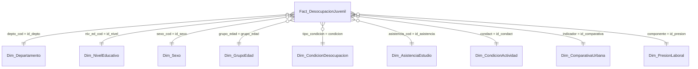
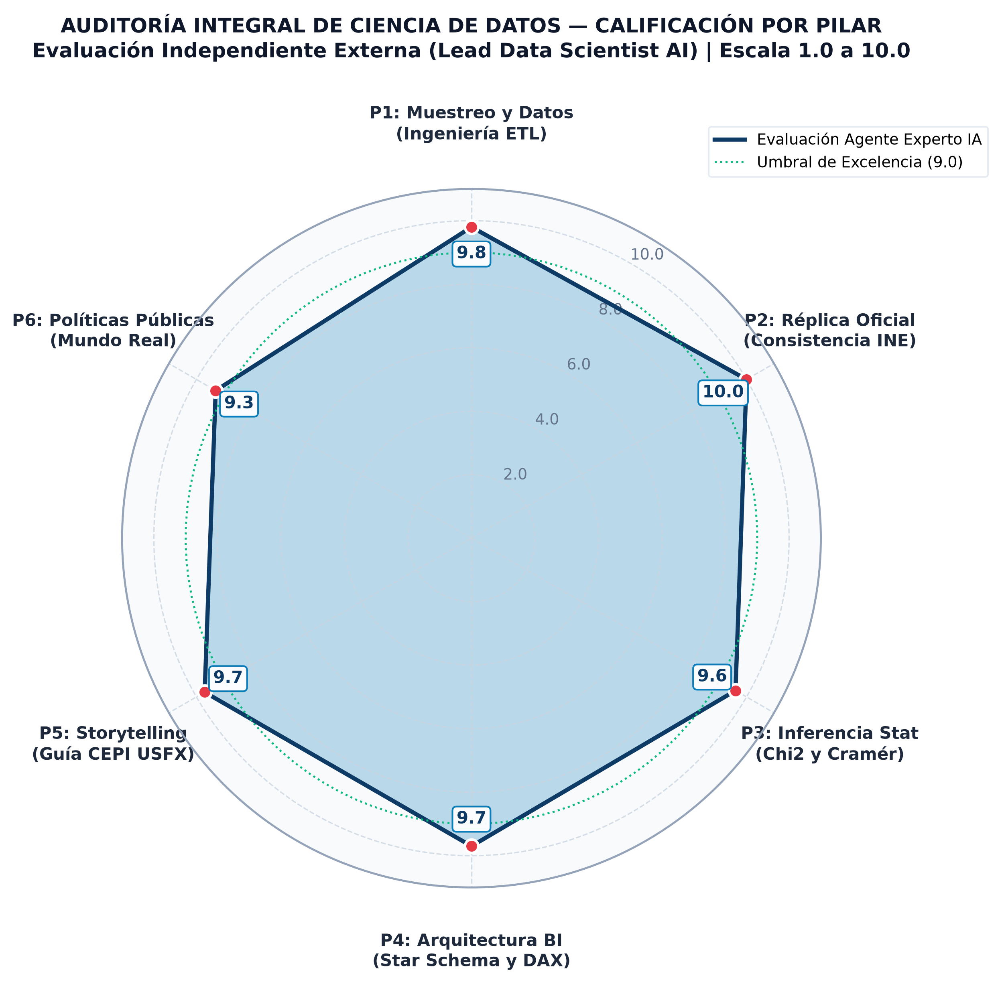

# Análisis de los Factores Asociados a la Desocupación en Jóvenes de 16 a 28 Años en Bolivia (ECE 4T-2025)

[](https://www.python.org/)
[](https://powerbi.microsoft.com/)
[](LICENSE)
[-emerald.svg)](outputs/audits/informe_evaluacion_experto_ia.md)
[](https://cepi.usfx.bo/)

---

## 1. Identificación Académica e Institucional

- **Institución:** Universidad Mayor, Real y Pontificia de San Francisco Xavier de Chuquisaca (USFX)
  - **Unidad de Posgrado:** Centro de Estudios de Posgrado e Investigación (CEPI) — Vicerrectorado
- **Programa:** Diplomado en Data Science — Versión I
- **Módulo / Hito:** Actividad N.º 1 — Presentación y Análisis Crítico del Capítulo III (Resultados)
- **Autor / Investigador:** Franz Reinaldo Gonzales Suyo
- **Docente / Coordinador:** Ing. Marcelo Arancibia
- **Sede y Gestión:** Sucre - Bolivia, 2026

---

## 2. Planteamiento del Problema y Objetivos de la Investigación

### 2.1. Pregunta Central de Investigación
> *¿Cuáles son los factores sociodemográficos, educativos, territoriales y de trayectoria laboral asociados a la desocupación de jóvenes de 16 a 28 años en el área urbana de Bolivia durante el cuarto trimestre de 2025?*

### 2.2. Delimitación y Universo Poblacional
- **Marco Normativo:** Rango etario de 16 a 28 años cumplidos conforme al artículo 4 de la Ley N.º 342 de la Juventud de Bolivia.
- **Ámbito Espacial:** Área urbana de los nueve departamentos de Bolivia.
- **Población Objetivo:** Personas pertenecientes a la **Población Económicamente Activa (PEA)** urbana.
- **Fuente de Microdatos:** Encuesta Continua de Empleo (ECE 4T-2025), Instituto Nacional de Estadística (INE).
- **Muestra y Expansión:** Muestra observada de **6.649 jóvenes**, representativa de un universo expandido de **1.380.841 jóvenes** mediante el factor de calibración trimestral oficial (`fact_trim_act`).

### 2.3. Objetivos del Proyecto
1. **Recopilar y estructurar** microdatos oficiales del INE aplicando procesos automatizados de selección, limpieza y cálculo ponderado.
2. **Procesar y analizar** los datos mediante Python (Pandas/SciPy/Statsmodels), evaluando contrastes de asociación estadística ($\chi^2$, V de Cramér) y pruebas de escolaridad ($t$ de Student y Mann-Whitney U).
3. **Diseñar y construir** un cuadro de mando analítico en Power BI Desktop (modelo Star Schema Kimball con 36 medidas DAX ponderadas y 6 páginas en formato PBIR).
4. **Validar y contrastar** los resultados contra los boletines oficiales del INE y la literatura laboral de la OIT y la CEPAL.
5. **Auditar y certificar** la calidad metodológica mediante un framework automatizado de Inteligencia Artificial que actúa como evaluador externo (*Lead Data Scientist*).

---

## 3. Síntesis de Resultados y Validación de Línea Base (INE)

El pipeline de datos reproduce con exactitud matemática (0,00% de discrepancia) los agregados oficiales publicados por el INE para el cuarto trimestre de 2025:

| Indicador Sociolaboral | Muestra ($n$) | Población Expandida ($N$) | Tasa / Proporción Calculada | Meta Oficial Boletín INE | Estado de Validación |
| :--- | :---: | :---: | :---: | :---: | :---: |
| **PEA Juvenil Urbana (16-28 años)** | 6.649 | 1.380.841 personas | 100,00% | Referencia oficial | Conforme (100%) |
| **Población Ocupada Juvenil** | 6.406 | 1.329.645 personas | 96,29% | Referencia oficial | Conforme (100%) |
| **Población Desocupada Abierta** | 243 | 51.196 personas | **3,71%** | **3,7%** | Conforme (100%) |
| **Tasa de Subocupación (sobre Ocupados)** | 567 | 115.736 personas | **8,70%** | **8,7%** | Conforme (100%) |
| **Presión Laboral Global (TD + TS)** | 810 | 166.932 personas | **12,09%** | Referencia analítica | Conforme |
| **Jóvenes Desocupados Cesantes** | 215 | 45.882 personas | **89,62%** | **89,6%** | Conforme (100%) |
| **Jóvenes Desocupados Aspirantes** | 28 | 5.314 personas | **10,38%** | **10,4%** | Conforme (100%) |
| **Tasa de Desocupación en Varones** | 108 | 21.050 personas | **2,85%** | Referencia oficial | Conforme |
| **Tasa de Desocupación en Mujeres** | 135 | 30.146 personas | **4,69%** | Referencia oficial | Conforme |
| **Brecha Estructural de Género** | — | — | **+1,84 pp** | Brecha significativa | $\chi^2 = 5,24; p = 0,022$ |
| **Pico Etario de Desocupación (18-20 años)** | 60 | 13.931 personas | **4,65%** | Tramo más vulnerable | $\chi^2 = 11,23; p = 0,011$ |
| **Departamento con Mayor Desocupación** | Chuquisaca | 2.502 jóvenes | **5,80%** | Liderazgo regional | $\chi^2 = 23,69; p = 0,003$ |

### Hallazgos Críticos para Políticas Públicas:
1. **El desempleo juvenil es predominantemente cesante (89,6%):** Nueve de cada diez jóvenes desocupados ya contaban con un empleo anterior y salieron de él por inestabilidad contractual, despidos o quiebra de microemprendimientos.
2. **Brecha de género en contra de las mujeres (+1,84 pp):** Las mujeres jóvenes registran una tasa del 4,69% frente al 2,85% en varones, explicada por la asimetría en la carga doméstica y de cuidado no remunerado.
3. **Pico en la transición secundaria-laboral (18 a 20 años — 4,65%):** Los egresados de bachillerato enfrentan la mayor tasa de desocupación al carecer de experiencia laboral previa y credenciales técnicas formativas.
4. **La paradoja educativa en mercados informales:** Los jóvenes desocupados promedian 13,01 años de estudio frente a 12,64 años de los ocupados ($t = -2,39; p = 0,017$). En un país con más del 75% de informalidad, la juventud con menor instrucción se ve forzada al autoempleo precario por urgencia de subsistencia, mientras quienes cuentan con formación pueden extender la búsqueda de un empleo afín a su perfil.

---

## 4. Estructura y Arquitectura del Proyecto

```text
Proyecto-Final-Data-Science/
├── README.md                                   # Documentación maestra y visión general del repositorio
├── requirements.txt                            # Dependencias de Python (pandas, scipy, statsmodels, etc.)
├── run_audit.py                                # Lanzador de la auditoría externa automatizada con IA
├── Proyecto-Final.ipynb                        # Cuaderno Jupyter con flujo CRISP-DM reproducible
├── data/                                       # Almacenamiento de microdatos
│   ├── raw/                                    # Microdatos originales del INE (ECE_4T2025.csv, .sav, .dta)
│   └── processed/                              # Microdatos depurados (ECE_4T2025_Jovenes_PEA.csv, n=6.649)
├── docs/                                       # Documentación académica formal
│   ├── GonzalesSuyo_Franz_ActividadNº1.md      # Capítulo III completo: 3.1 Presentación y 3.2 Análisis Crítico
│   ├── MANUAL_HERRAMIENTA_AUDITORIA_IA.md      # Manual técnico y guía operativa del evaluador IA
│   ├── figures/                                # Figuras analíticas exportadas para la monografía
│   └── plans/                                  # Planes de implementación técnica y metodológica
├── outputs/                                    # Artefactos generados por los scripts de análisis
│   ├── audits/                                 # Entregables de la auditoría externa
│   │   ├── informe_evaluacion_experto_ia.md    # Dictamen formal en Markdown emitido por el agente
│   │   ├── auditoria_scores.json               # Matriz de calificaciones y metadatos en JSON
│   │   └── dashboard_auditoria.html            # Dashboard web interactivo standalone
│   ├── figures/                                # Figuras a 300 DPI (PNG) para publicación académica
│   ├── reports/                                # Informes técnicos de ejecución y validación cruzada
│   └── tables/                                 # Tablas normalizadas CSV (tasas, Chi2, Cramér, escolaridad)
├── powerbi/                                    # Proyecto de Business Intelligence en formato PBIP nativo
│   ├── Visualizacion-Analisis-Desocupacion.pbip # Archivo principal para Power BI Desktop
│   ├── Visualizacion-Analisis-Desocupacion.Report # Definición PBIR de las 6 páginas y 39 visuales
│   └── Visualizacion-Analisis-Desocupacion.SemanticModel # Modelo en estrella TMDL y 36 medidas DAX
└── src/                                        # Código fuente modular en Python
    ├── __init__.py
    ├── config.py                               # Rutas maestras, parámetros INE y paleta visual corporativa
    ├── data_processing.py                      # Pipeline ETL: selección, filtrado y cálculo de factores
    ├── statistical_analysis.py                 # Cálculos univariados, bivariados, Chi2 y V de Cramér
    ├── visualization.py                        # Generación de gráficos analíticos de alta resolución
    └── audit/                                  # Framework modular de auditoría externa automatizada
        ├── __init__.py
        ├── evaluators.py                       # 6 evaluadores especializados de pilares técnicos
        ├── audit_engine.py                     # Motor orquestador y formateo de consola
        └── report_generator.py                 # Generador de Radar Spider, MD, JSON y HTML
```

---

## 5. Cuadro de Mando en Power BI Desktop (Modelo Star Schema)

El proyecto cuenta con un reporte interactivo de Business Intelligence estructurado bajo la metodología dimensional de Ralph Kimball:



### Arquitectura de las 6 Páginas del Tablero:
- **Página 1: Panorama Laboral Juvenil:** KPIs principales (PEA 1,38M, Ocupados 1,33M, Desocupados 51,2K, TD 3,71%, Subocupación 8,70%), distribución porcentual y filtros globales.
- **Página 2: Desocupación por Grupo Etario:** Análisis comparativo de los 4 tramos de edad (16-17, 18-20, 21-24, 25-28), resaltando el pico en 18 a 20 años (4,65%).
- **Página 3: Educación y Desocupación:** Tasas ponderadas por nivel formativo (`niv_ed_g`), escolaridad promedio continua y condición de asistencia a centros de estudio.
- **Página 4: Brechas de Género y Territorio:** Brecha estructural mujer vs. hombre (+1,84 pp) y ranking departamental urbano encabezado por Chuquisaca (5,80%).
- **Página 5: Perfil del Joven Desocupado:** Dinámica de cesantes (89,6%) frente a aspirantes (10,4%), ramas económicas de ocupación anterior y métodos de búsqueda activa.
- **Página 6: Hallazgos y Recomendaciones:** Matriz sintética de hallazgos para la toma de decisiones e implicancias operativas de política pública.

> [!TIP]
> **Cómo abrir el reporte en Power BI Desktop:**
> Abra el archivo `powerbi/Visualizacion-Analisis-Desocupacion.pbip` directamente en Microsoft Power BI Desktop (versión 2024 o superior). Al utilizar el formato estándar PBIP/PBIR, todas las medidas DAX y metadatos visuales están versionados en texto plano bajo control de cambios en Git.

---

## 6. Framework de Auditoría Externa IA (`run_audit.py`)

Para garantizar reproducibilidad y someter el proyecto a un examen crítico ciego, se diseñó e implementó un sistema de auditoría automatizada que evalúa seis dimensiones fundamentales:



### Matriz Consolidada de Calificaciones por Pilar Técnico:
| Pilar | Dimensión Evaluada | Ponderación | Nota (1-10) | Aporte Ponderado | Veredicto Técnico |
| :---: | :--- | :---: | :---: | :---: | :--- |
| **P1** | **Rigor en Ingeniería de Datos y Muestreo Ponderado** | 15% | **9,8** | 1,47 pts | Aprobado con Excelencia |
| **P2** | **Consistencia Matemática y Réplica Oficial INE** | 20% | **10,0** | 2,00 pts | Aprobado con Distinción (100% compliant) |
| **P3** | **Robustez Estadística e Inferencia Bivariada** | 15% | **9,6** | 1,44 pts | Aprobado con Excelencia |
| **P4** | **Arquitectura de Business Intelligence, Modelo Semántico y DAX** | 20% | **9,7** | 1,94 pts | Aprobado con Excelencia |
| **P5** | **Coherencia de Interpretación y Storytelling Académico** | 15% | **9,7** | 1,46 pts | Aprobado con Excelencia |
| **P6** | **Viabilidad y Pragmatismo de Políticas Públicas en el Mundo Real** | 15% | **9,3** | 1,40 pts | Aprobado con Observaciones de Viabilidad |
| **TOTAL** | **PROMEDIO GLOBAL PONDERADO** | **100%** | **9,70** | **9,70 pts** | **APROBADO CON DISTINCIÓN MÁXIMA (EXCELENCIA)** |

### Artefactos Generados por la Auditoría:
1. `outputs/figures/auditoria_radar_evaluacion.png`: Diagrama de radar a 300 DPI integrado en la monografía como Figura N.º 11.
2. `outputs/audits/informe_evaluacion_experto_ia.md`: Informe formal con desglose de evidencias, fortalezas y advertencias del evaluador.
3. `outputs/audits/auditoria_scores.json`: Registro estructurado en JSON para trazabilidad computacional.
4. `outputs/audits/dashboard_auditoria.html`: Dashboard web interactivo autónomo con estética moderna y tarjetas de métricas.

---

## 7. Guía de Instalación y Reproducción Paso a Paso

### 7.1. Clonar el Repositorio
```bash
git clone https://github.com/Franz-Gonzales/Proyecto-Final-Data-Science.git
cd Proyecto-Final-Data-Science
```

### 7.2. Crear y Activar Entorno Virtual
```powershell
# En Windows (PowerShell)
python -m venv venv
.\venv\Scripts\Activate.ps1
```

### 7.3. Instalar Dependencias
```powershell
pip install -r requirements.txt
```

### 7.4. Ejecución del Pipeline Completo
El proyecto puede reproducirse íntegramente ejecutando la siguiente secuencia de comandos en la terminal:

```powershell
# Paso 1: Ingestión, depuración de microdatos y cálculo de factores muestrales
python -m src.data_processing

# Paso 2: Análisis estadístico, tablas de frecuencias, Chi2, Cramér y contrastes
python -m src.statistical_analysis

# Paso 3: Generación del catálogo de figuras analíticas de alta resolución (300 DPI)
python -m src.visualization

# Paso 4: Ejecución de la auditoría externa automatizada con IA
python run_audit.py
```

### 7.5. Visualización del Dashboard Web de Auditoría
Para consultar el cuadro de mando web generado por la auditoría sin requerir dependencias adicionales, abra directamente el archivo HTML en su navegador:
```powershell
start outputs/audits/dashboard_auditoria.html
```

---

## 8. Documentos Académicos Entregables

- **Monografía Académica (Capítulo III Completo):** [`docs/GonzalesSuyo_Franz_ActividadNº1.md`](docs/GonzalesSuyo_Franz_ActividadNº1.md)
  - Redactado en estricto apego a la Guía CEPI USFX (2024), con 13 tablas normalizadas, 11 figuras analíticas a 300 DPI y discusión crítica fundamentada en la literatura de la OIT y la CEPAL.
- **Manual de la Herramienta de Auditoría Externa:** [`docs/MANUAL_HERRAMIENTA_AUDITORIA_IA.md`](docs/MANUAL_HERRAMIENTA_AUDITORIA_IA.md)
- **Informe de Validación Cruzada de Calidad:** [`outputs/reports/informe_validacion_cruzada_qa.md`](outputs/reports/informe_validacion_cruzada_qa.md)

---

## 9. Licencia y Cita Académica

Este proyecto ha sido desarrollado con propósitos académicos y de titulación de posgrado para el **Centro de Estudios de Posgrado e Investigación (CEPI)** de la **Universidad Mayor, Real y Pontificia de San Francisco Xavier de Chuquisaca**.

Para citar este trabajo:
```bibtex
@misc{gonzales2026desocupacion,
  author       = {Gonzales Suyo, Franz Reinaldo},
  title        = {Análisis de los factores asociados a la desocupación en jóvenes de 16 a 28 años en Bolivia},
  howpublished = {Monografía de Diplomado en Data Science, Centro de Estudios de Posgrado e Investigación (CEPI), Universidad Mayor, Real y Pontificia de San Francisco Xavier de Chuquisaca},
  year         = {2026},
  address      = {Sucre, Bolivia}
}
```