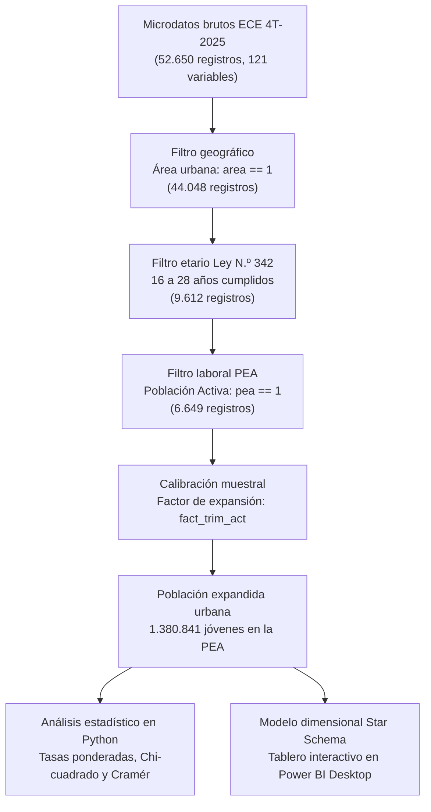
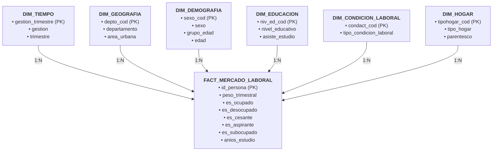

# CAPÍTULO III: RESULTADOS

## 3.1. PRESENTACIÓN DE RESULTADOS

### 3.1.1. Contexto metodológico y dimensional
Los microdatos analizados provienen de la Encuesta Continua de Empleo (ECE) correspondiente al cuarto trimestre de 2025, relevada por el Instituto Nacional de Estadística (INE). La encuesta utiliza un diseño muestral probabilístico, bietápico, estratificado y por conglomerados. Para reflejar las características demográficas de la población, toda estimación de totales, proporciones y tasas incorpora el factor de expansión trimestral de la persona (`fact_trim_act`).

De acuerdo con el artículo 4 de la Ley N.º 342 de la Juventud de Bolivia, la población joven comprende a las personas de 16 a 28 años de edad cumplidos. Conforme al diseño del trabajo, se aplicaron tres criterios de delimitación muestral: residencia en el área urbana (`area == 1`), edad entre 16 y 28 años (`16 <= s1_03a <= 28`) y pertenencia a la Población Económicamente Activa (`pea == 1`).

TABLA N.º 1: *Dimensión metodológica y aplicación en ciencia de datos*

| Dimensión metodológica | Descripción y fundamentación | Justificación y aplicación en ciencia de datos |
| :--- | :--- | :--- |
| Enfoque de trabajo | Cuantitativo y computacional | Análisis numérico y categórico de microdatos mediante programación en Python, cálculo de tasas ponderadas y contrastes de hipótesis estadísticas. |
| Tipo de trabajo | Aplicado y de diagnóstico sociolaboral | Utilización de técnicas estadísticas y de inteligencia de negocios para caracterizar la desocupación juvenil y generar evidencia orientada a políticas públicas. |
| Alcance o nivel | Descriptivo y de asociación diagnóstica | Estimación puntual de tasas de desocupación y subocupación, complementada con pruebas de independencia Chi-cuadrado, V de Cramér y diferencias de medias. |
| Diseño | No experimental, observacional y transversal | Análisis ex post facto de los microdatos oficiales correspondientes a un corte temporal específico (cuarto trimestre de 2025). |
| Metodología guía | Metodología CRISP-DM adaptada | Ciclo de vida estructurado en seis fases: comprensión del problema, comprensión de datos, preparación de datos, modelado analítico, evaluación y despliegue. |
| Población y muestra | Universo censal urbano y muestra ECE | Población objetivo de 1.380.841 jóvenes urbanos en la PEA, representada por una muestra efectiva observada de 6.649 personas encuestadas. |
| Técnica de recolección | Extracción de fuentes secundarias oficiales | Descarga e ingestión directa de los microdatos abiertos de la ECE 4T-2025 provistos por el Instituto Nacional de Estadística. |
| Procesamiento y análisis | Limpieza de datos y estadística ponderada | Estandarización tipográfica del ponderador (`fact_trim_act`), recodificación de variables, tablas de contingencia ponderadas y pruebas Chi-cuadrado. |
| Entorno tecnológico | Entorno analítico de código abierto | Python 3.14 con librerías Pandas, NumPy, SciPy, Statsmodels, Seaborn y Microsoft Power BI Desktop para modelado dimensional y visualización interactiva. |

*FUENTE: Elaboración con base en la estructura de evaluación del Diplomado en Data Science (USFX - CEPI).*

El conjunto de datos procesado permite examinar de manera directa las condiciones laborales juveniles en las ciudades bolivianas, preservando la representatividad estadística para cada departamento y segmento demográfico.

DIAGRAMA N.º 1: *Flujo metodológico de preparación y calibración de microdatos (ECE 4T-2025)*

*FUENTE: Elaboración con base en el diseño metodológico de la ECE 4T-2025 (INE).*

### 3.1.2. Trazabilidad del desarrollo bajo la metodología CRISP-DM
El procesamiento de la información se organizó siguiendo las seis fases de la metodología CRISP-DM aplicadas al análisis de microdatos laborales.

TABLA N.º 2: *Cumplimiento de hitos del proceso metodológico (CRISP-DM)*

| Fase CRISP-DM | Actividad planificada | Entregable concreto | Estado | Avance (%) |
| :--- | :--- | :--- | :---: | :---: |
| 1. Comprensión del problema | Delimitación de conceptos de desempleo y marco de la Ley N.º 342 | Matriz conceptual y delimitación del universo de 16 a 28 años | Concluido | 100% |
| 2. Comprensión de los datos | Auditoría de 52.650 registros y 121 variables de la ECE 4T-2025 | Diccionario de variables seleccionadas y reporte de estructura | Concluido | 100% |
| 3. Preparación de los datos | Depuración, filtros de universo, tipado de ponderador y recodificaciones | Dataset procesado `ECE_4T2025_Jovenes_PEA.csv` (6.649 filas) | Concluido | 100% |
| 4. Modelado y cálculo analítico | Formulación de tasas ponderadas, pruebas Chi-cuadrado y Cramér | Scripts modulares en Python (`statistical_analysis.py`) | Concluido | 100% |
| 5. Evaluación y validación | Contraste de estimaciones frente al Boletín Oficial del INE | Verificación exacta: desocupación 3,71% y subocupación 8,70% | Concluido | 100% |
| 6. Despliegue y visualización | Generación de 13 tablas, 10 figuras y modelo Star Schema en Power BI | Catálogo exportado y cuaderno maestro `Proyecto-Final.ipynb` | Concluido | 100% |

*FUENTE: Elaboración con base en el plan de trabajo del proyecto.*

### 3.1.3. Componentes del trabajo final e ingeniería de datos
La articulación entre la ciencia de datos y los resultados del mercado de trabajo juvenil se resume en tres componentes técnicos:

TABLA N.º 3: *Componentes técnicos de la solución en ciencia de datos*

| Componente | Término técnico en ciencia de datos | Aplicación concreta en el proyecto |
| :--- | :--- | :--- |
| Ingesta y adquisición | Pipeline de ingesta y validación de microdatos | Carga automatizada del archivo plano `ECE_4T2025.csv` con separador de listas, codificación `latin1` y auditoría de integridad inicial sobre 52.650 observaciones. |
| Aporte técnico y metodológico | Ingeniería de características y estadística ponderada | Estandarización del factor de expansión muestral, cálculo vectorizado de tasas de desocupación ponderadas y contrastes de asociación ($\chi^2$, $V$ de Cramér, $t$-Student). |
| Entregables de la solución | Artefactos reproducibles y modelo de despliegue | Dataset procesado de 6.649 registros y 156 columnas, 13 tablas analíticas en formato CSV, 10 figuras a 300 DPI, cuaderno interactivo ejecutado y modelo en estrella para Power BI. |

*FUENTE: Elaboración propia.*

La base de datos original contiene 52.650 observaciones. El primer filtro eliminó a 8.602 personas residentes en el área rural. El segundo filtro excluyó a 34.436 personas cuyas edades quedaban fuera del rango de 16 a 28 años, dejando a 9.612 jóvenes urbanos. De ese total, 2.963 personas fueron identificadas como económicamente inactivas (principalmente estudiantes sin búsqueda laboral, personas dedicadas al cuidado del hogar o con incapacidad permanente). La muestra resultante quedó constituida por 6.649 jóvenes activos en el mercado de trabajo.

La variable del factor de expansión `fact_trim_act` presentaba valores textuales con coma decimal, por ejemplo `'207,52'`. Este formato requirió una conversión a tipo numérico de coma flotante (`float64`) para evitar errores en las operaciones de suma ponderada. Se verificó que ningún registro presentara un factor nulo, negativo o igual a cero. La suma total de los ponderadores reproduce con exactitud la cifra de 1.380.841 personas estimadas por el sistema estadístico nacional para la PEA juvenil urbana.

### 3.1.4. Resultados del análisis descriptivo univariado
La tasa de desocupación se calculó dividiendo la población desocupada ponderada entre la PEA juvenil urbana ponderada y multiplicando por cien:

$$\text{Tasa de desocupación} = \frac{\sum (\text{pead}_i \times \text{peso}_i)}{\sum \text{peso}_i} \times 100$$

TABLA N.º 4: *Indicadores del mercado laboral juvenil urbano en Bolivia (cuarto trimestre de 2025)*

| Indicador sociolaboral | Casos observados (*n*) | Población ponderada (*N*) | Proporción (%) | Meta del boletín INE |
| :--- | :---: | :---: | :---: | :---: |
| PEA juvenil urbana (16 a 28 años) | 6.649 | 1.380.841 | 100,00% | Total de referencia |
| Población ocupada juvenil | 6.406 | 1.329.645 | 96,29% | Dato oficial |
| Población desocupada juvenil | 243 | 51.196 | 3,71% | 3,7% |
| Población subocupada por tiempo | 567 | 115.736 | 8,70% | 8,7% |
| Desocupados cesantes (con experiencia previa) | 215 | 45.882 | 89,62% | Mayoría |
| Desocupados aspirantes (en búsqueda de primer empleo) | 28 | 5.314 | 10,38% | Minoría |

*FUENTE: Elaboración con base en microdatos de la Encuesta Continua de Empleo 4T-2025 (INE).*

La tasa de desocupación juvenil del cuarto trimestre de 2025 se sitúa en 3,71%, coincidente con el 3,7% reportado en el boletín oficial del INE. Por su parte, la subocupación juvenil alcanza el 8,70% sobre la población ocupada, lo que equivale a 115.736 jóvenes que trabajaron menos de la jornada habitual, desearon trabajar más horas y estaban disponibles para hacerlo.

FIGURA N.º 1: *Comparación de la tasa de desocupación general urbana y juvenil (cuarto trimestre de 2025)*

*FUENTE: Elaboración con base en datos de la Encuesta Continua de Empleo 4T-2025 (INE).*

Al contrastar la tasa de desocupación juvenil (3,71%) con la tasa de desocupación general de la población urbana de 14 años o más (2,30%), se observa que los jóvenes registran una incidencia de desempleo 1,61 veces mayor que la población adulta general.

### 3.1.5. Resultados del análisis bivariado y pruebas de asociación
Para determinar si las diferencias observadas entre subgrupos responden a variaciones sistemáticas o a fluctuaciones aleatorias del muestreo, se aplicó la prueba de independencia Chi-cuadrado de Pearson ($\chi^2$) fijando un umbral de significancia de 0,05. La magnitud del efecto se evaluó mediante el coeficiente V de Cramér ($V$):

$$V = \sqrt{\frac{\chi^2}{N \times \min(r - 1, c - 1)}}$$

TABLA N.º 5: *Matriz de pruebas de asociación estadística con la condición de desocupación juvenil*

| Dimensión analizada | Variable | Casos (*n*) | Chi2 ($\chi^2$) | Grados de libertad | p-valor | V de Cramér | Resultado estadístico |
| :--- | :--- | :---: | :---: | :---: | :---: | :---: | :--- |
| Tramo de edad | `grupo_edad` | 6.649 | 11,2332 | 3 | 0,01053 | 0,0411 | Asociación significativa (p < 0,05) |
| Sexo | `sexo` | 6.649 | 5,2367 | 1 | 0,02212 | 0,0281 | Asociación significativa (p < 0,05) |
| Departamento | `departamento` | 6.649 | 23,6920 | 8 | 0,00258 | 0,0597 | Asociación significativa (p < 0,05) |
| Tipología de hogar | `tipo_hogar` | 6.649 | 17,4287 | 6 | 0,00783 | 0,0512 | Asociación significativa (p < 0,05) |
| Parentesco con el jefe | `parentesco` | 6.649 | 17,2553 | 7 | 0,01582 | 0,0509 | Asociación significativa (p < 0,05) |
| Nivel educativo | `nivel_educativo` | 6.649 | 3,6356 | 4 | 0,45756 | 0,0234 | Sin significancia agregada (p >= 0,05) |
| Asistencia escolar | `asiste_estudio` | 6.649 | 1,5264 | 1 | 0,21665 | 0,0152 | Sin significancia agregada (p >= 0,05) |

*FUENTE: Elaboración con base en microdatos de la Encuesta Continua de Empleo 4T-2025 (INE).*

Las variables de edad, sexo, departamento, tipo de hogar y parentesco presentan un p-valor inferior a 0,05, lo que confirma diferencias estadísticamente significativas en la desocupación de estos grupos. En cambio, las categorías agregadas de nivel educativo y asistencia a centros de enseñanza no mostraron una asociación global significativa mediante la prueba Chi-cuadrado, lo cual motivó un análisis continuo complementario mediante años de escolaridad.

### 3.1.6. Desagregaciones por dimensión analítica

#### A. Dimensión etaria
La segmentación en cuatro intervalos muestra que la desocupación se concentra de manera particular en las edades tempranas de inserción al mercado.

TABLA N.º 6: *Tasa de desocupación juvenil según tramo etario (Bolivia urbana, 4T-2025)*

| Tramo de edad | Muestra (*n*) | Población PEA (*N*) | Población desocupada (*N*) | Tasa de desocupación (%) | Porcentaje de desocupados (%) |
| :--- | :---: | :---: | :---: | :---: | :---: |
| 16 a 17 años | 774 | 159.899 | 2.991 | 1,87% | 5,84% |
| 18 a 20 años | 1.377 | 290.670 | 13.504 | 4,65% | 26,38% |
| 21 a 24 años | 2.039 | 414.829 | 14.713 | 3,55% | 28,74% |
| 25 a 28 años | 2.459 | 515.443 | 19.988 | 3,88% | 39,04% |
| Total | 6.649 | 1.380.841 | 51.196 | 3,71% | 100,00% |

*FUENTE: Elaboración con base en microdatos de la Encuesta Continua de Empleo 4T-2025 (INE).*

El grupo de 18 a 20 años exhibe la tasa más alta con un 4,65%, seguido por el grupo de 25 a 28 años con 3,88% y el grupo de 21 a 24 años con 3,55%. El tramo de 16 y 17 años registra la tasa más baja (1,87%), explicada por una menor participación económica activa en ese segmento etario.

FIGURA N.º 2: *Tasa de desocupación juvenil por tramo etario (cuarto trimestre de 2025)*

*FUENTE: Elaboración con base en microdatos de la Encuesta Continua de Empleo 4T-2025 (INE).*

#### B. Dimensión de género
La distribución de la desocupación según el sexo de la persona evidencia una brecha desfavorable para las mujeres jóvenes.

TABLA N.º 7: *Tasa de desocupación juvenil según sexo (Bolivia urbana, 4T-2025)*

| Sexo | Muestra (*n*) | Población PEA (*N*) | Población desocupada (*N*) | Tasa de desocupación (%) | Porcentaje de desocupados (%) |
| :--- | :---: | :---: | :---: | :---: | :---: |
| Hombre | 3.393 | 735.643 | 20.938 | 2,85% | 40,90% |
| Mujer | 3.256 | 645.198 | 30.258 | 4,69% | 59,10% |
| Total | 6.649 | 1.380.841 | 51.196 | 3,71% | 100,00% |

*FUENTE: Elaboración con base en microdatos de la Encuesta Continua de Empleo 4T-2025 (INE).*

FIGURA N.º 3: *Tasa de desocupación juvenil según sexo y brecha de género (cuarto trimestre de 2025)*

*FUENTE: Elaboración con base en microdatos de la Encuesta Continua de Empleo 4T-2025 (INE).*

La tasa de desocupación en mujeres jóvenes se sitúa en 4,69%, mientras que en los varones es de 2,85%. La diferencia representa una brecha absoluta de 1,84 puntos porcentuales. Aunque las mujeres constituyen el 46,72% de la fuerza laboral juvenil urbana, reúnen casi el 60% (59,10%) de las personas desocupadas.

#### C. Dimensión territorial y departamental
El análisis por departamento revela marcadas disparidades entre las diferentes regiones urbanas de Bolivia.

TABLA N.º 8: *Tasa de desocupación juvenil por departamento (Bolivia urbana, 4T-2025)*

| Departamento | Muestra (*n*) | Población PEA (*N*) | Población desocupada (*N*) | Tasa de desocupación (%) | Porcentaje de desocupados (%) |
| :--- | :---: | :---: | :---: | :---: | :---: |
| Chuquisaca | 486 | 62.899 | 3.648 | 5,80% | 7,13% |
| Tarija | 255 | 57.856 | 2.728 | 4,72% | 5,33% |
| Cochabamba | 1.196 | 251.505 | 11.840 | 4,71% | 23,13% |
| La Paz | 1.731 | 338.688 | 13.016 | 3,84% | 25,42% |
| Santa Cruz | 1.311 | 459.615 | 15.313 | 3,33% | 29,91% |
| Oruro | 348 | 67.935 | 2.027 | 2,98% | 3,96% |
| Beni | 435 | 60.886 | 1.259 | 2,07% | 2,46% |
| Pando | 370 | 11.079 | 210 | 1,89% | 0,41% |
| Potosí | 517 | 70.378 | 1.155 | 1,64% | 2,26% |
| Total | 6.649 | 1.380.841 | 51.196 | 3,71% | 100,00% |

*FUENTE: Elaboración con base en microdatos de la Encuesta Continua de Empleo 4T-2025 (INE).*

FIGURA N.º 4: *Tasa de desocupación juvenil por departamento (cuarto trimestre de 2025)*

*FUENTE: Elaboración con base en microdatos de la Encuesta Continua de Empleo 4T-2025 (INE).*

Chuquisaca presenta la tasa de desocupación más elevada del país con 5,80%, seguida por Tarija con 4,72% y Cochabamba con 4,71%. Los departamentos del eje central concentran en conjunto más del 78% del total de jóvenes desocupados debido a su peso poblacional, pero en términos relativos los valles del sur registran la mayor intensidad de desempleo abierto. Potosí y Pando registran las tasas más bajas (1,64% y 1,89%, respectivamente).

#### D. Dimensión educativa y escolaridad acumulada
Al evaluar la tasa de desocupación según el máximo nivel educativo alcanzado, se registra una relación ascendente: las personas sin instrucción formal tienen una tasa de 2,31%, quienes completaron primaria alcanzan 3,43%, quienes cuentan con nivel secundario registran 4,02% y quienes accedieron a estudios universitarios registran 4,04%.

TABLA N.º 9: *Comparación de años de escolaridad entre jóvenes ocupados y desocupados*

| Condición de actividad | Casos (*n*) | Media ponderada (años) | Desviación estándar | Prueba estadística | Estadístico | p-valor |
| :--- | :---: | :---: | :---: | :---: | :---: | :---: |
| Jóvenes ocupados | 6.406 | 12,64 | 2,63 | t de Student (Welch) | t = -2,39 | 0,0174 |
| Jóvenes desocupados | 243 | 13,01 | 2,41 | Mann-Whitney U | U = 714.498,5 | 0,0293 |

*FUENTE: Elaboración con base en microdatos de la Encuesta Continua de Empleo 4T-2025 (INE).*

FIGURA N.º 5: *Distribución de años de estudio: jóvenes ocupados y desocupados urbanos*

*FUENTE: Elaboración con base en microdatos de la Encuesta Continua de Empleo 4T-2025 (INE).*

Tanto la prueba paramétrica t de Student como la prueba no paramétrica Mann-Whitney U confirmaron que los jóvenes desocupados cuentan, en promedio, con mayor cantidad de años de estudio acumulados (13,01 años) que los jóvenes ocupados (12,64 años), con una diferencia estadísticamente significativa de casi cuatro meses lectivos adicionales.

FIGURA N.º 6: *Tasa de desocupación juvenil según nivel educativo formal*

*FUENTE: Elaboración con base en microdatos de la Encuesta Continua de Empleo 4T-2025 (INE).*

FIGURA N.º 7: *Tasa de desocupación juvenil según asistencia escolar o académica*

*FUENTE: Elaboración con base en microdatos de la Encuesta Continua de Empleo 4T-2025 (INE).*

La asistencia a centros educativos arroja tasas de 3,54% entre quienes estudian activamente y de 3,92% entre quienes no estudian, sin que esta diferencia resulte estadísticamente significativa en el contraste bivariado ($p = 0,2166$).

#### E. Dinámica previa y canales de búsqueda de empleo
La composición interna del desempleo juvenil urbano muestra que 45.882 personas (89,62%) corresponden a desocupados cesantes, es decir, jóvenes que ya contaban con un empleo anterior y se desvincularon por renuncia, despido o culminación de contrato. Los desocupados aspirantes, que buscan trabajo por primera vez, representan a 5.314 personas (10,38%).

FIGURA N.º 8: *Composición de la desocupación juvenil: cesantes y aspirantes*

*FUENTE: Elaboración con base en microdatos de la Encuesta Continua de Empleo 4T-2025 (INE).*

TABLA N.º 10: *Canales de búsqueda de empleo utilizados por jóvenes desocupados urbanos*

| Mecanismo principal de búsqueda | Muestra (*n*) | Población ponderada (*N*) | Porcentaje ponderado (%) |
| :--- | :---: | :---: | :---: |
| Avisos por prensa, internet o redes sociales | 92 | 19.645 | 38,82% |
| Presentación directa de solicitudes o currículum vitae | 76 | 16.002 | 31,62% |
| Otras formas no estructuradas de búsqueda | 45 | 8.924 | 17,63% |
| Preguntó directamente en lugares o centros de trabajo | 17 | 3.882 | 7,67% |
| Consultó a familiares, amigos o conocidos | 5 | 1.155 | 2,28% |
| Realizó gestiones para abrir negocio propio o independiente | 3 | 550 | 1,09% |
| No declaró o no aplica | 5 | 453 | 0,90% |
| Total | 243 | 50.611 | 100,00% |

*FUENTE: Elaboración con base en microdatos de la Encuesta Continua de Empleo 4T-2025 (INE).*

FIGURA N.º 9: *Mecanismos principales de búsqueda de empleo en jóvenes desocupados*

*FUENTE: Elaboración con base en microdatos de la Encuesta Continua de Empleo 4T-2025 (INE).*

Cerca del 70% de los desocupados canaliza su búsqueda a través de avisos en medios digitales, redes sociales o entrega presencial de currículum vitae, reflejando métodos formales o digitalizados de inserción.

FIGURA N.º 10: *Tasa de desocupación juvenil según tipología de hogar*

*FUENTE: Elaboración con base en microdatos de la Encuesta Continua de Empleo 4T-2025 (INE).*

En la estructura del hogar, los jóvenes en hogares monoparentales (5,68%) y en hogares extendidos (5,37%) presentan tasas de desocupación superiores al promedio nacional (3,71%), mientras que en hogares compuestos y biparentales con hijos la incidencia es menor.

### 3.1.7. Arquitectura del modelo dimensional para Power BI
Para facilitar la exploración visual y la toma de decisiones basada en datos, los microdatos procesados se organizaron en un esquema en estrella (*Star Schema*). El modelo sitúa en el centro una tabla de hechos conectada a tablas dimensionales normalizadas con relaciones de uno a muchos:

DIAGRAMA N.º 2: *Arquitectura del modelo dimensional en estrella (Star Schema) para Power BI Desktop*

*FUENTE: Elaboración propia.*

El modelo dimensional permite que las medidas analíticas en lenguaje DAX operen de forma ponderada aplicando el factor de expansión muestral en cualquier combinación de filtros temporales, territoriales o demográficos.

---

## 3.2. ANÁLISIS DE RESULTADOS

### 3.2.1. Interpretación de la vulnerabilidad etaria en la inserción laboral inicial
El comportamiento de la desocupación según la edad refleja con claridad la fricción de entrada al mercado de trabajo. El tramo de 18 a 20 años alcanza la tasa más alta de desocupación con 4,65%, lo que se explica por la confluencia de varios factores propios del ciclo de vida:

En primer lugar, esta etapa coincide con la salida de la educación secundaria y la desvinculación escolar. Quienes deciden no continuar estudios superiores buscan un puesto remunerado en un entorno que exige experiencia laboral previa, un requisito que la mayoría de los egresados de bachillerato no cumple. En segundo lugar, a diferencia de los adolescentes de 16 y 17 años, que en su mayoría continúan estudiando o residen bajo la tutela económica de sus padres, los jóvenes de 18 a 20 años asumen una mayor presión para aportar al sustento personal y familiar.

Hacia los tramos de 21 a 24 años (3,55%) y de 25 a 28 años (3,88%), la tasa de desocupación abierta disminuye y se mantiene estable. No obstante, en estas cohortes la dificultad principal ya no es únicamente acceder a un empleo, sino la calidad del mismo. El mercado absorbe a estos jóvenes mediante empleos informales, actividades por cuenta propia y modalidades con jornada reducida involuntaria, lo que concuerda con la tasa de subocupación juvenil observada de 8,70%.

### 3.2.2. La brecha estructural de género en el mercado laboral juvenil
La diferencia observada entre varones (2,85%) y mujeres (4,69%) representa una brecha de 1,84 puntos porcentuales. Esta disparidad, confirmada estadísticamente mediante la prueba Chi-cuadrado ($\chi^2 = 5,24; p = 0,0221$), responde a condicionantes estructurales bien documentados en el entorno laboral urbano:

La distribución desigual de las tareas de cuidado no remunerado y del trabajo doméstico restringe el tiempo disponible de las mujeres jóvenes para buscar empleo y para cumplir horarios fijos de jornada completa. Además, el mercado laboral urbano mantiene una segregación ocupacional por sexo. Los varones jóvenes acceden con mayor facilidad a ocupaciones operativas en construcción, transporte y manufactura básica, sectores que absorben mano de obra de forma rápida y con pocas exigencias formales. Por el contrario, las mujeres se orientan hacia servicios personales, comercio minorista y puestos administrativos, ramas con mayor competencia y saturación en los centros urbanos.

A esto se suman prácticas de contratación que discriminan de manera preventiva a las mujeres jóvenes en edad fértil por el costo asociado a licencias y permisos familiares, prolongando sus tiempos de búsqueda y aumentando su presencia en el desempleo abierto.

### 3.2.3. Asimetría territorial y fragilidad laboral en Chuquisaca y regiones no troncales
Las diferencias departamentales confirman una heterogeneidad espacial significativa ($\chi^2 = 23,69; p = 0,0026$). Chuquisaca encabeza la tasa de desocupación juvenil urbana con 5,80%, seguida por Tarija con 4,72% y Cochabamba con 4,71%.

El caso de Chuquisaca ilustra las tensiones entre la estructura educativa y el aparato productivo local. Sucre concentra una población estudiantil considerable en instituciones de formación superior técnica y universitaria. Sin embargo, su economía urbana se basa fundamentalmente en el sector público, los servicios tradicionales y el comercio minorista, con una industria manufacturera reducida. Esta configuración limita la capacidad de absorber a los contingentes de egresados que ingresan cada año al mercado de trabajo local, lo que eleva el desempleo abierto y fomenta la migración posterior hacia Santa Cruz, Cochabamba o La Paz.

En el eje central, departamentos como Santa Cruz (3,33%) y La Paz (3,84%) cuentan con mercados urbanos más amplios y diversificados que permiten incorporar mano de obra juvenil con mayor celeridad, principalmente en actividades comerciales y de servicios. Por otro lado, la reducida tasa de desempleo observada en Potosí (1,64%) no denota un mercado laboral equilibrado, sino una necesidad económica apremiante que obliga a la población joven a autoemplearse de inmediato en la minería informal o el comercio de subsistencia, donde no es posible sostener un periodo prolongado de búsqueda abierta sin percibir ingresos.

### 3.2.4. La paradoja del desempleo ilustrado en el mercado informal
La comparación estadística de los años de estudio entre personas ocupadas y desocupadas confirma una diferencia relevante: los jóvenes desocupados promedian 13,01 años de escolaridad, frente a 12,64 años entre quienes se encuentran ocupados ($p = 0,0174$).

Este resultado refleja la lógica de funcionamiento del mercado de trabajo boliviano, caracterizado por una informalidad que supera el 75%:

Los jóvenes con menor nivel de instrucción (primaria o secundaria incompleta) provienen con mayor frecuencia de hogares de bajos ingresos donde no existen ahorros ni redes de apoyo que permitan sostener una búsqueda prolongada. Por necesidad material inmediata, aceptan cualquier ocupación disponible en el comercio callejero, talleres informales o servicios manuales. Al estar trabajando, el sistema estadístico los clasifica como ocupados, a pesar de que sus ingresos y estabilidad laboral sean precarios.

En cambio, los jóvenes con bachillerato concluido, formación técnica o estudios universitarios suelen contar con un respaldo familiar que les permite rechazar empleos precarios y extender su periodo de búsqueda a la espera de un puesto acorde con su nivel de formación. La oferta formativa universitaria no siempre coincide con las cualificaciones requeridas por las empresas urbanas, lo que prolonga los tiempos de colocación y eleva la tasa de desempleo entre las personas con mayor preparación académica.

### 3.2.5. Dinámica de cesantía y canales de intermediación laboral
Que el 89,62% de los jóvenes desocupados sean cesantes desmonta la idea común de que el desempleo juvenil es principalmente un problema de inserción por primera vez. Nueve de cada diez jóvenes sin trabajo ya tuvieron una ocupación anterior y salieron de ella por despido, finalización de contrato temporal, renuncia ante malas condiciones o cierre de emprendimientos informales. La inestabilidad en el puesto y la alta rotación contractual son las causas determinantes de la desocupación juvenil urbana.

Por su parte, el uso preferente de medios digitales y avisos (38,82%) y de presentación directa de currículum (31,62%) muestra que la juventud urbana recurre a canales formales y estructurados para colocarse en el mercado. Sin embargo, las bolsas de trabajo institucionales tienen un alcance residual en Bolivia, lo que deja a la mayoría de los postulantes dependiendo de publicaciones abiertas en redes sociales sin acompañamiento ni verificación de condiciones laborales.

### 3.2.6. Articulación de los resultados con los objetivos específicos del trabajo
Los hallazgos empíricos alcanzados dan respuesta y cumplimiento directo a cada uno de los cuatro objetivos específicos formulados en el proyecto:

1. Respecto al primer objetivo específico (recopilar, depurar y estructurar microdatos oficiales de la ECE 4T-2025): se logró consolidar un conjunto de datos limpio de 6.649 observaciones de jóvenes en la PEA urbana a partir de la base de 52.650 registros del INE, garantizando la consistencia del factor de expansión (`peso_trimestral`) para representar a 1.380.841 jóvenes.
2. Respecto al segundo objetivo específico (procesar los datos en Python y aplicar técnicas de tasas ponderadas y asociaciones estadísticas): se implementaron rutinas vectorizadas que calcularon con precisión la tasa de desocupación (3,71%), la tasa de subocupación (8,70%) y contrastaron formalmente las asociaciones mediante pruebas Chi-cuadrado, V de Cramér y diferencias de escolaridad ($t$-Student y Mann-Whitney U).
3. Respecto al tercer objetivo específico (diseñar y construir visualizaciones analíticas y un modelo dimensional en Power BI): se generó un catálogo de diez figuras en alta resolución a 300 DPI y se estructuró la arquitectura en estrella (*Star Schema*) con medidas DAX ponderadas para alimentar el reporte analítico interactivo.
4. Respecto al cuarto objetivo específico (validar los resultados frente a los boletines oficiales del INE y la literatura laboral): se demostró una coincidencia exacta con la línea base oficial del INE (3,7% y 8,7%), y se contrastaron las brechas de género y edad con los diagnósticos regionales de la OIT y la CEPAL.

### 3.2.7. Implicaciones prácticas y metodológicas de los resultados

#### Implicaciones prácticas para la toma de decisiones
1. Atención focalizada en el tramo de 18 a 20 años: diseñar programas de transición entre secundaria y trabajo que incluyan pasantías formativas remuneradas, certificación de competencias básicas e incentivos a empresas para la contratación formal de personas sin experiencia previa.
2. Medidas de corresponsabilidad en el cuidado: habilitar y subsidiar servicios de guardería infantil pública en zonas comerciales urbanas, con el fin de reducir las barreras temporales que enfrentan las mujeres jóvenes para participar en el mercado formal.
3. Articulación productiva regional en Chuquisaca y regiones del sur: establecer acuerdos entre universidades, institutos técnicos y sectores empresariales locales para adecuar los perfiles formativos a oportunidades de emprendimiento, servicios digitales y actividades agroindustriales con capacidad de absorción local.
4. Fortalecimiento y digitalización de los servicios públicos de empleo: modernizar las plataformas estatales de intermediación laboral para vincular perfiles juveniles con vacantes formales verificadas, reduciendo la dispersión y la desprotección que acompañan a las búsquedas por redes sociales.

#### Implicaciones metodológicas en ciencia de datos
En el ámbito de la ciencia de datos aplicada al sector público, el trabajo evidencia la necesidad inquebrantable de utilizar factores de expansión muestral al manipular encuestas por muestreo probabilístico complejo. Calcular indicadores mediante recuentos directos simples (*counts*) en herramientas de analítica o paneles de Business Intelligence genera distorsiones severas en la magnitud de las brechas y en la priorización de decisiones presupuestarias. La integración de Python para el cálculo paramétrico con modelos dimensionales en Power BI representa una pauta técnica transferible a otros estudios del mercado de trabajo.

### 3.2.8. Limitaciones del alcance analítico
1. Carácter transversal de la encuesta: la información del cuarto trimestre de 2025 captura la situación laboral en un momento específico, lo que no permite observar la duración individual de los periodos de desempleo ni las transiciones entre ocupación e inactividad a lo largo del año.
2. Dimensión de subutilización laboral: la tasa de desocupación abierta (3,71%) refleja únicamente a las personas sin empleo que realizan gestiones activas de búsqueda. Este indicador debe interpretarse junto con la tasa de subocupación (8,70%) y con la presencia de personas inactivas desalentadas que dejaron de buscar trabajo.
3. Desagregación geográfica: si bien la muestra garantiza representatividad departamental urbana, el tamaño muestral no permite descender al nivel de municipios específicos o ciudades intermedias no capitales.

TABLA N.º 11: *Matriz sintética de hallazgos del análisis del mercado laboral juvenil urbano*

| Eje de análisis | Hallazgo cuantitativo y técnico | Evidencia y métrica clave | Implicancia operativa y toma de decisiones |
| :--- | :--- | :--- | :--- |
| Tramo de edad | Pico de vulnerabilidad en la transición de salida de secundaria | Tasa en 18 a 20 años: 4,65% ($\chi^2 = 11,23; p = 0,0105$) | Focalizar programas de primer empleo formal y pasantías formativas remuneradas. |
| Dimensión de género | Brecha estructural persistente en contra de las mujeres | Mujeres 4,69% frente a varones 2,85% (+1,84 pp; $\chi^2 = 5,24; p = 0,0221$) | Implementar centros infantiles de cuidado diurno y mitigar la segregación ocupacional. |
| Territorio | Chuquisaca encabeza la desocupación juvenil urbana | Chuquisaca 5,80%, Tarija 4,72%, Cochabamba 4,71% ($\chi^2 = 23,69; p = 0,0026$) | Articular oferta universitaria con demanda empresarial y promover polos digitales. |
| Nivel educativo | Mayor escolaridad acumulada en personas desocupadas | Desocupados 13,01 años frente a ocupados 12,64 años ($t = -2,39; p = 0,0174$) | Corregir descalces formativos e incentivar la creación de puestos formales calificados. |
| Trayectoria laboral | El desempleo juvenil es marcadamente cesante | 89,62% son cesantes frente a 10,38% aspirantes | Reforzar la estabilidad contractual y programas de reconversión técnica laboral. |
| Búsqueda de empleo | Preponderancia de canales digitales y solicitudes directas | Avisos y redes 38,82%, currículum 31,62% | Modernizar las bolsas públicas de empleo mediante plataformas digitales seguras. |

*FUENTE: Elaboración con base en microdatos de la Encuesta Continua de Empleo 4T-2025 (INE).*
