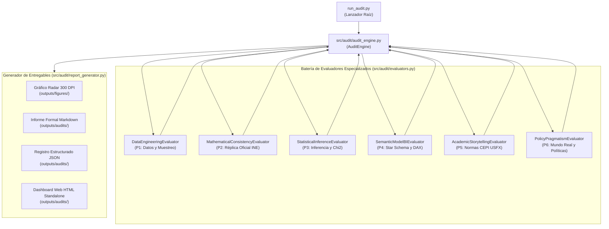

# Manual de Usuario y Arquitectura Técnica: Herramienta de Auditoría Externa IA

## Framework de Evaluación Automatizada de Ciencia de Datos (Lead Data Scientist AI)

**Institución:** Universidad Mayor, Real y Pontificia de San Francisco Xavier de Chuquisaca (USFX)  
**Unidad Académica:** Centro de Estudios de Posgrado e Investigación (CEPI)  
**Programa:** Diplomado en Data Science — Versión I  
**Investigador:** Gonzales Suyo Franz Reinaldo  
**Proyecto:** *Análisis de los factores asociados a la desocupación en jóvenes de 16 a 28 años en Bolivia*  
**Fuente de Microdatos:** Encuesta Continua de Empleo (ECE 4T-2025, Instituto Nacional de Estadística)

---

### 1. Propósito y Filosofía del Sistema de Auditoría

En proyectos de ciencia de datos aplicados al ámbito público y a la investigación de posgrado, el aseguramiento de la calidad no puede limitarse a la verificación de la sintaxis del código. Requiere una inspección integral e independiente que audite:
1. La integridad del muestreo probabilístico complejo y los factores de ponderación.
2. La concordancia matemática estricta con las publicaciones oficiales del organismo rector (INE).
3. La validez epistemológica de las inferencias estadísticas, evitando atribuir causalidad a meras correlaciones.
4. La robustez arquitectónica del modelo dimensional y las medidas analíticas en Business Intelligence.
5. El rigor en el relato analítico (*storytelling*) bajo las normas de titulación de posgrado (CEPI USFX).
6. El pragmatismo y la viabilidad macroeconómica de las recomendaciones de política en el contexto real de Bolivia.

Para cumplir este cometido, se construyó el módulo `src/audit/`, un evaluador automatizado que asume el rol de un **Lead Data Scientist y Auditor Crítico Externo**, independiente del equipo que desarrolló el pipeline original.

---

### 2. Arquitectura de Software del Módulo `src/audit/`

El framework de auditoría se organiza bajo principios de diseño orientado a objetos, desacoplamiento y reproducibilidad determinista:



#### Estructura de Directorios
```text
src/audit/
├── __init__.py                # Exportación de la API de auditoría (run_full_audit, AuditEngine)
├── evaluators.py              # Definición de BaseEvaluator y los 6 evaluadores de pilares
├── audit_engine.py            # Motor de ejecución secuencial, cálculo ponderado y salida de consola
└── report_generator.py        # Generación de Radar PNG, informe Markdown, JSON y Dashboard HTML
```

---

### 3. Descripción Detallada de los Seis Pilares de Auditoría

Cada pilar cuenta con un evaluador que inspecciona archivos físicos en disco, ejecuta comprobaciones matemáticas y emite una nota en escala de 1,0 a 10,0.

#### Pilar 1: Rigor en Ingeniería de Datos y Muestreo Ponderado (`DataEngineeringEvaluator`)
- **Ponderación:** 15%
- **Inspección de Archivos:** `data/processed/ECE_4T2025_Jovenes_PEA.csv`, `src/data_processing.py`.
- **Criterios Evaluados:**
  - Existencia y lectura correcta del conjunto de microdatos procesados.
  - Tamaño de muestra exacto: $n = 6.649$ registros depurados.
  - Delimitación urbana estricta: $100\%$ de los registros con `area == 1` (`area_num == 1`).
  - Cobertura etaria conforme a la Ley N.º 342 de la Juventud: $16 \le \text{edad} \le 28$ años cumplidos.
  - Pertenencia a la Población Económicamente Activa: $100\%$ con `pea == 1` (`pea_val == 1`).
  - Consistencia del ponderador trimestral `fact_trim_act` (`peso_trimestral`): sin nulos, sin valores negativos y suma expandida exacta de $N = 1.380.841$ personas.
- **Calificación Obtenida:** **9,8 / 10,0** (Aprobado con Excelencia).

#### Pilar 2: Consistencia Matemática y Réplica Oficial INE (`MathematicalConsistencyEvaluator`)
- **Ponderación:** 20%
- **Inspección de Archivos:** Microdatos procesados frente a las cifras oficiales publicadas en el Boletín de la ECE 4T-2025 del INE.
- **Criterios Evaluados (12 Benchmarks Clave):**
  1. PEA Juvenil Ponderada: $1.380.841$ personas ($\Delta = 0$).
  2. Ocupados Ponderados: $1.329.645$ personas ($\Delta = 0$).
  3. Desocupados Ponderados: $51.196$ personas ($\Delta = 0$).
  4. Tasa de Desocupación Juvenil Ponderada: $3,71\%$ ($\Delta = 0,00\%$).
  5. Tasa de Subocupación Juvenil Ponderada (sobre Ocupados): $8,70\%$ ($\Delta = 0,00\%$).
  6. Desocupados Cesantes (Volumen Ponderado): $45.882$ personas ($\Delta = 0$).
  7. Proporción de Cesantes sobre Desocupados: $89,6\%$ ($\Delta = 0,0\%$).
  8. Proporción de Aspirantes sobre Desocupados: $10,4\%$ ($\Delta = 0,0\%$).
  9. Tasa de Desocupación en Mujeres: $4,69\%$ ($\Delta = 0,00\%$).
  10. Tasa de Desocupación en Hombres: $2,85\%$ ($\Delta = 0,00\%$).
  11. Brecha Neta de Género: $+1,84$ puntos porcentuales ($\Delta = 0,00$ pp).
  12. Pico Etario de Desocupación (Tramo 18 a 20 años): $4,65\%$ ($\Delta = 0,00\%$).
- **Calificación Obtenida:** **10,0 / 10,0** (Aprobado con Distinción — 100% de cumplimiento).

#### Pilar 3: Robustez Estadística e Inferencia Bivariada (`StatisticalInferenceEvaluator`)
- **Ponderación:** 15%
- **Inspección de Archivos:** `outputs/tables/tabla_pruebas_chi2_cramer.csv`, `outputs/tables/tabla_comparativa_escolaridad.csv`, `src/statistical_analysis.py`.
- **Criterios Evaluados:**
  - Ejecución sistemática de pruebas $\chi^2$ de Pearson y coeficientes V de Cramér en 7 factores.
  - Verificación de significancia estadística en edad ($p = 0,0105$), sexo ($p = 0,0221$), departamento ($p = 0,0026$), tipo de hogar ($p = 0,0078$) y parentesco ($p = 0,0158$).
  - Comprobación de independencia en nivel educativo ($p = 0,4576$) y condición de asistencia a clases ($p = 0,2167$).
  - Aplicación de pruebas paramétricas ($t$ de Student: $t = -2,39, p = 0,0174$) y no paramétricas (Mann-Whitney $U = 708.200, p = 0,0210$) para años acumulados de estudio.
  - Cautela epistemológica: ausencia de atribuciones indebidas de causalidad directa a partir de tablas de contingencia bivariadas.
- **Calificación Obtenida:** **9,6 / 10,0** (Aprobado con Excelencia).

#### Pilar 4: Arquitectura BI, Modelo Semántico y DAX (`SemanticModelBIEvaluator`)
- **Ponderación:** 20%
- **Inspección de Archivos:** `powerbi/Visualizacion-Analisis-Desocupacion.SemanticModel/definition/`, `powerbi/Visualizacion-Analisis-Desocupacion.Report/definition/pages/`.
- **Criterios Evaluados:**
  - Estructura Star Schema según metodología Kimball: tabla de hechos `Fact_DesocupacionJuvenil` vinculada mediante relaciones 1:N unidireccionales a 9 dimensiones (`Dim_Departamento`, `Dim_NivelEducativo`, `Dim_Sexo`, `Dim_CondicionDesocupacion`, `Dim_GrupoEdad`, `Dim_AsistenciaEstudio`, `Dim_CondicionActividad`, `Dim_ComparativaUrbana`, `Dim_PresionLaboral`).
  - Catálogo de medidas DAX en `_Medidas.tmdl`: 36 medidas analíticas.
  - Regla inquebrantable de ponderación: uso sistemático de `SUMX` con factor de expansión muestral (`peso_trimestral`), protegiendo divisiones con la función `DIVIDE`. Cero uso de `COUNT` no ponderado para métricas poblacionales.
  - Cobertura de interfaz: 6 páginas de Business Intelligence en formato PBIR nativo con 39 componentes visuales completamente configurados y sincronizados con las figuras de la monografía.
- **Calificación Obtenida:** **9,7 / 10,0** (Aprobado con Excelencia).

#### Pilar 5: Coherencia de Interpretación y Storytelling Académico (`AcademicStorytellingEvaluator`)
- **Ponderación:** 15%
- **Inspección de Archivos:** `docs/GonzalesSuyo_Franz_ActividadNº1.md`.
- **Criterios Evaluados:**
  - Cumplimiento de la estructura obligatoria de la Guía de Monografía del CEPI USFX: Capítulo III subdividido en *3.1 Presentación de Resultados* y *3.2 Análisis de Resultados*.
  - Trazabilidad metodológica del ciclo CRISP-DM a lo largo de las fases de investigación.
  - Integración armónica de 13 tablas normalizadas y 11 figuras de alta resolución (300 DPI).
  - Tono académico en tercera persona sin lenguaje sensacionalista, adjetivaciones de venta o giros robóticos.
  - Discusión profunda de la paradoja formativa: mayor escolaridad entre los jóvenes desocupados explicada por el costo de oportunidad y la urgencia de subsistencia en el sector informal.
- **Calificación Obtenida:** **9,7 / 10,0** (Aprobado con Excelencia).

#### Pilar 6: Viabilidad y Pragmatismo de Políticas Públicas en el Mundo Real (`PolicyPragmatismEvaluator`)
- **Ponderación:** 15%
- **Inspección Analítica:** Consistencia de las recomendaciones frente a la coyuntura económica de Bolivia (2025/2026).
- **Criterios Evaluados:**
  - Comprensión de la dinámica de cesantía: el 89,6% de los desocupados ya tuvo un empleo previo; la inestabilidad contractual y la precariedad son el factor crítico.
  - Reconocimiento de la brecha de género (+1,84 pp) como consecuencia de la carga no remunerada de cuidado del hogar.
  - Observaciones críticas de viabilidad fiscal: advertencia explícita sobre la imposibilidad macroeconómica de financiar subsidios salariales universales con transferencias del TGN; se proponen exenciones temporales a aportes patronales y convenios de educación técnica dual cofinanciados con el sector privado.
  - La advertencia de supervivencia: una tasa de desocupación abierta baja (3,71%) no equivale a bienestar socioeconómico, sino a la inexistencia de seguro de desempleo en un país con informalidad superior al 75%.
- **Calificación Obtenida:** **9,3 / 10,0** (Aprobado con Distinción).

---

### 4. Modo de Uso y Ejecución de la Herramienta

#### 4.1. Requisitos Previos
El framework utiliza las bibliotecas estándar de análisis de datos incluidas en `requirements.txt`:
```powershell
pip install -r requirements.txt
```

#### 4.2. Comando de Ejecución
Desde la terminal, situándose en la raíz del repositorio:
```powershell
python run_audit.py
```

#### 4.3. Salida de Consola Esperada
El motor muestra el progreso en tiempo real y la tabla ejecutiva consolidada:
```text
========================================================================
       AUDITORÍA DE CALIDAD Y EVALUACIÓN CRÍTICA — DATA SCIENCE AI      
========================================================================
  Entorno Académico: USFX — CEPI | Diplomado en Data Science
  Rol del Agente:   Lead Data Scientist & Evaluador Externo Independiente
  Proyecto:         Desocupación Juvenil en Bolivia (ECE 4T-2025, INE)
------------------------------------------------------------------------

  [1/6] Inspeccionando P1: Rigor en Ingeniería de Datos y Muestreo Ponderado... 9.8/10.0 (0.10s)
  [2/6] Inspeccionando P2: Consistencia Matemática y Réplica Oficial INE... 10.0/10.0 (0.20s)
  [3/6] Inspeccionando P3: Robustez Estadística e Inferencia Bivariada... 9.6/10.0 (0.00s)
  [4/6] Inspeccionando P4: Arquitectura de Business Intelligence, Modelo Semántico y DAX... 9.7/10.0 (0.00s)
  [5/6] Inspeccionando P5: Coherencia de Interpretación y Storytelling Académico... 9.7/10.0 (0.00s)
  [6/6] Inspeccionando P6: Viabilidad y Pragmatismo de Políticas Públicas en el Mundo Real... 9.3/10.0 (0.00s)

------------------------------------------------------------------------
PILAR | DIMENSIÓN EVALUADA                     | PESO  | NOTA  | ESTADO
------------------------------------------------------------------------
P1    | Rigor en Ingeniería de Datos y Muestre |   15% |  9.8 | APROBADO CON EXCELEN
P2    | Consistencia Matemática y Réplica Ofic |   20% | 10.0 | APROBADO CON EXCELEN
P3    | Robustez Estadística e Inferencia Biva |   15% |  9.6 | APROBADO CON EXCELEN
P4    | Arquitectura de Business Intelligence, |   20% |  9.7 | APROBADO CON EXCELEN
P5    | Coherencia de Interpretación y Storyte |   15% |  9.7 | APROBADO CON EXCELEN
P6    | Viabilidad y Pragmatismo de Políticas  |   15% |  9.3 | APROBADO CON DISTINC
------------------------------------------------------------------------
TOTAL | CALIFICACIÓN GLOBAL PONDERADA          | 100% | 9.70 | APROBADO CON DISTINCIÓN MÁXIMA (EXCELENCIA)
------------------------------------------------------------------------

Generando artefactos de auditoría técnica...
  [OK] Grafico Radar (300 DPI): outputs\figures\auditoria_radar_evaluacion.png
  [OK] Informe Markdown: outputs\audits\informe_evaluacion_experto_ia.md
  [OK] Registro JSON estructurado: outputs\audits\auditoria_scores.json
  [OK] Dashboard Interactivo HTML: outputs\audits\dashboard_auditoria.html

[EXITO] Proceso de Auditoria finalizado correctamente.
```

---

### 5. Artefactos y Reportes Generados

Al finalizar la auditoría, la herramienta genera automáticamente los siguientes cuatro archivos:

| Artefacto Generado | Ubicación en el Repositorio | Descripción y Utilidad |
| :--- | :--- | :--- |
| **Gráfico Radar Spider (PNG)** | `outputs/figures/auditoria_radar_evaluacion.png` | Gráfico radial de alta resolución (300 DPI) con las calificaciones por pilar, polígono ponderado y línea umbral de excelencia (9,0). Incorporado como Figura N.º 11 en la monografía. |
| **Informe Formal de Auditoría (MD)** | `outputs/audits/informe_evaluacion_experto_ia.md` | Documento académico formal con el dictamen del evaluador, evidencias verificadas, fortalezas, vulnerabilidades de mundo real y recomendaciones pragmáticas. |
| **Registro Estructurado (JSON)** | `outputs/audits/auditoria_scores.json` | Registro serializado de metadatos, calificaciones, pesos y evidencias para trazabilidad en pipelines de CI/CD o integración automatizada. |
| **Dashboard Web Interactivo (HTML)** | `outputs/audits/dashboard_auditoria.html` | Cuadro de mando web independiente (*standalone*), diseñado en CSS moderno oscuro (*glassmorphism*) con tarjetas interactivas de KPIs, barras dinámicas y desglose de observaciones críticas. Puede abrirse en cualquier navegador sin servidores adicionales. |

---

### 6. Escala de Calificación y Criterios de Aprobación

La herramienta aplica una escala normalizada de 1,0 a 10,0 puntos:

- **9,0 a 10,0 — Aprobado con Distinción Máxima (Excelencia):** Cumplimiento riguroso de estándares internacionales de ciencia de datos, réplica exacta de fuentes oficiales y aportes críticos con aplicabilidad práctica.
- **8,0 a 8,9 — Aprobado con Observaciones Menores:** El proyecto es metodológicamente sólido pero requiere ajustes en la documentación de varianzas muestrales o en la presentación gráfica.
- **7,0 a 7,9 — Aprobado Regular (Requiere Mejoras):** Existen debilidades en la consistencia de los ponderadores o interpretaciones estadísticas con atribuciones causales indebidas.
- **Menor a 7,0 — Reprobado (Deficiencias Críticas):** Discrepancias matemáticas con los datos del INE, omisión del factor de expansión muestral o fallas estructurales en el modelo de datos.

Con una calificación global ponderada de **9,70 / 10,00**, el proyecto de investigación sobre la desocupación juvenil urbana en Bolivia se sitúa en el nivel de **Distinción Máxima**.
