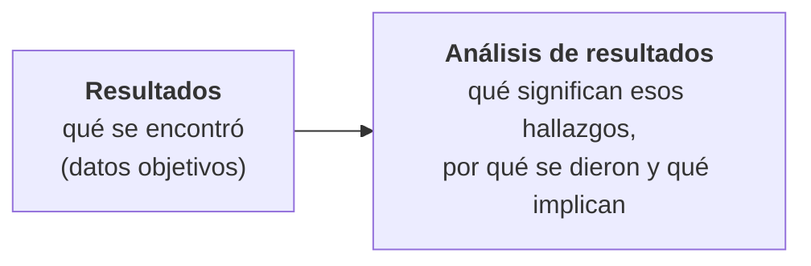
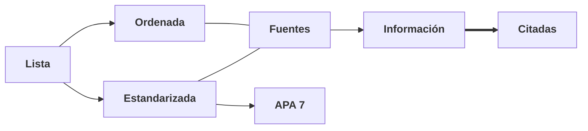

# DIPLOMADO EN DATA SCIENCE

**VERSIÓN I**

## Elaboración y revisión de la monografía

Ing. Marcelo Arancibia

> *[Imagen: escudo de la Universidad Mayor Real y Pontificia de San Francisco Xavier de Chuquisaca — "Universidad Mayor Real y Pontificia de San Francisco Xavier — Chuquisaca — Fundada en 27 de marzo de 1624"]*

---

## Cronograma

| SEMANA NRO. | DIA | FECHA | HORA | MODALIDAD | ACTIVIDADES | POND % |
|:---:|:---|:---:|:---:|:---|:---|:---:|
| 1 | MARTES | 29/09/2025 | 19:30 | Plataforma de videoconferencia | Presentación inicial del módulo. Clase sincrónica con apoyo visual (presentación PPT) | - |
| 2 | DOMINGO | 04/10/2026 | 23:59 | Plataforma virtual del diplomado | **Actividad 1:** Presentación del capítulo III | 25% |
| 2 | MARTES | 06/10/2026 | 19:30 | Mediante planificación por lista | Retroalimentación del capítulo III y revisión Individual (GRUPO 1) | - |
| | JUEVES | 08/10/2026 | 19:30 | Mediante planificación por lista | Retroalimentación del capítulo III y revisión individual (GRUPO 2) | - |
| | VIERNES | 09/10/2026 | 19:30 | Mediante planificación por lista | Retroalimentación del capítulo III y revisión individual (GRUPO 3) | - |
| 3 | DOMINGO | 11/10/2026 | 23:59 | Plataforma virtual del diplomado | **Actividad 2:** Presentación de la versión corregida del capítulo III, conclusiones, recomendaciones, referencias bibliográficas, anexos y resumen ejecutivo. | 25% |
| 3 | MARTES | 13/10/2026 | 19:30 | Plataforma de videoconferencia | Retroalimentación del capítulo III y revisión individual (GRUPO 1). | - |
| 4 | JUEVES | 15/10/2026 | 19:30 | Plataforma de videoconferencia | Retroalimentación del capítulo III y revisión individual (GRUPO 2) | - |
| | VIERNES | 16/10/2026 | 19:30 | Plataforma de videoconferencia | Retroalimentación del capítulo III y revisión individual (GRUPO 3) | - |
| 4 | DOMINGO | 18/10/2026 | 223:59 | Plataforma virtual del diplomado | **Actividad 3:** Presentación final de la monografía corregida | 50% |
| | | | | | **TOTAL:** | **100%** |

---

## Formato

```text
╭──────────────────────────────────────────────╮
│  Resumen                                     │
│  Índices                                     │
│  CAPITULO I: INTRODUCCION                    │
│     1.1.  Antecedentes                       │
│     1.2.  Problema o asunto del trabajo      │
│     1.3.  Objetivo general                   │
│     1.4.  Objetivos específicos              │
│     1.5.  Justificación                      │
│     1.6.  Enfoque Metodológico               │
│  CAPITULO II: MARCO REFERENCIAL              │
│     2.1.  Marco Teórico                      │
│     2.2.  Marco Contextual                   │
│  CAPITULO III: RESULTADOS                    │
│     3.1. Presentación de resultados          │
│     3.2. Análisis de Resultados              │
│  CONCLUSIONES Y RECOMENDACIONES              │
│  REFERENCIAS BIBLIOGRAFICAS                  │
│  ANEXOS                                      │
╰──────────────────────────────────────────────╯
```

Estructura del formato (versión lista):

- Resumen
- Índices
- **CAPITULO I: INTRODUCCION**
  - 1.1. Antecedentes
  - 1.2. Problema o asunto del trabajo
  - 1.3. Objetivo general
  - 1.4. Objetivos específicos
  - 1.5. Justificación
  - 1.6. Enfoque Metodológico
- **CAPITULO II: MARCO REFERENCIAL**
  - 2.1. Marco Teórico
  - 2.2. Marco Contextual
- **CAPITULO III: RESULTADOS**
  - 3.1. Presentación de resultados
  - 3.2. Análisis de Resultados
- **CONCLUSIONES Y RECOMENDACIONES**
- **REFERENCIAS BIBLIOGRAFICAS**
- **ANEXOS**

---

## Desarrollo del Documento

- El documento debe ajustarse estrictamente al formato establecido para la monografía.
- Se entrega siempre el archivo completo en formato Word.
- Todas las observaciones señaladas deben estar corregidas e incorporadas.
- La no corrección de las observaciones afectará directamente la calificación de la entrega.
- Fecha de entrega: la establecida en el cronograma (sin excepciones).

---

## Desarrollo del Documento

- Formato del nombre del archivo a presentar: **Apellidos_Nombre_ActividadNº.docx**
  Ejemplo: `RamírezTorres_Luis_Actividad3.docx`
- Extensión sugerida de la monografía concluida: **50 páginas** desde el Capítulo I hasta Recomendaciones inclusive (no se cuentan portada, índices, anexos ni referencias).

---

## Revisión del trabajo de monografía

Cada estudiante deberá presentar el desarrollo de su propuesta.

**La presentación debe evidenciar:**

### 1. Diseño y Arquitectura de la Solución

- **Modelo de datos o arquitectura del sistema:** Diagrama o descripción de cómo fluyen los datos (desde la fuente, pasando por el almacenamiento y procesamiento, hasta el modelo analítico).
- **Definición de variables y características (Features):** Detalle de las variables seleccionadas, justificando por qué son relevantes para el objetivo del diplomado (ingeniería de características).

---

## Revisión del trabajo de monografía

Cada estudiante deberá presentar el desarrollo de su propuesta.

**La presentación debe evidenciar:**

### 2. Metodología y Procesamiento de Datos

- **Preprocesamiento y limpieza (Data Wrangling):** Tratamiento de valores faltantes, detección de valores atípicos (outliers), normalización o estandarización y codificación de variables categóricas.
- **Técnicas y algoritmos aplicados:** Justificación de los algoritmos de Machine Learning, estadística o minería de datos utilizados (por ejemplo, modelos de clasificación, regresión, clustering, redes neuronales, etc.).
- **Entorno de desarrollo:** Herramientas, librerías y lenguajes utilizados (Python, R, bibliotecas como Scikit-Learn, Pandas, TensorFlow, etc.).

---

## Revisión del trabajo de monografía

Cada estudiante deberá presentar el desarrollo de su propuesta.

**La presentación debe evidenciar:**

### 3. Implementación y Resultados

- **Entrenamiento y validación:** Cómo se dividió el conjunto de datos (entrenamiento, prueba y validación) y las técnicas de validación cruzada aplicadas para evitar el overfitting (sobreajuste).
- **Métricas de evaluación:** Resultados obtenidos según los indicadores adecuados al tipo de problema (por ejemplo: matriz de confusión, accuracy, precisión, recall, F1-score, RMSE o MAE).
- **Interpretación de resultados:** Análisis de lo que dicen los datos y el modelo en el contexto del problema de estudio (por ejemplo, la importancia de las variables o feature importance).

---

## Revisión del trabajo de monografía

Cada estudiante deberá presentar el desarrollo de su propuesta.

**La presentación debe evidenciar:**

### 4. Propuesta de Valor o Aplicabilidad

- **Despliegue o integración (Deployment):** Cómo se utilizarían estos resultados en un escenario real (un dashboard, una API, un informe automatizado o una recomendación estratégica).
- **Limitaciones de la solución:** Factores que el modelo o análisis no cubre y posibles riesgos o sesgos identificados en los datos.

---

## Revisión del trabajo de monografía

### Requisitos obligatorios:

El trabajo debe demostrar todo ese contenido desarrollado aplicando las técnicas de data science.

**Se evaluará:**

- Diseño y Arquitectura de la Solución.
- Metodología y Procesamiento de Datos.
- Implementación y Resultados.
- Propuesta de Valor o Aplicabilidad

---

# CAPÍTULO III: Resultados

Aquí se muestra evidencia visual y concreta de todo lo que realmente hicieron y obtuvieron.

## Resultados

### Proceso

Los resultados de la investigación son la presentación objetiva de los hallazgos obtenidos durante el estudio. Describen qué se descubrió a partir del trabajo realizado, sin incluir interpretaciones, explicaciones o juicios de valor.

### Resultados

**Aplicación de la metodología**

---

## 1. Contexto Metodológico

| Dimensión Metodológica | Descripción y Fundamentación | Justificación / Aplicación en Data Science |
|:---|:---|:---|
| **Enfoque de Investigación** | Cuantitativo | Se fundamenta en la recolección, estructuración y análisis de variables numéricas y categóricas para medir patrones, modelar probabilidades y contrastar hipótesis mediante herramientas estadísticas y algoritmos matemáticos. |
| **Tipo de Investigación** | Aplicada y Tecnológica | No busca únicamente el desarrollo de nueva teoría pura, sino utilizar técnicas consolidadas de Machine Learning y minería de datos para solucionar un problema concreto u optimizar la toma de decisiones en un entorno operativo o de negocio. |
| **Alcance o Nivel** | Descriptivo - Correlacional / Predictivo | Comienza describiendo el comportamiento histórico del conjunto de datos (fase EDA) y avanza hacia un nivel predictivo o prescriptivo mediante el modelado de variables independientes para estimar variables objetivo (target). |
| **Diseño de la Investigación** | No experimental, transversal o longitudinal | No se manipulan intencionalmente las variables independientes en un laboratorio; se trabaja con datos observacionales históricos (ex post facto), analizados en un corte temporal específico o en secuencias ordenadas de tiempo. |
| **Marco o Metodología Guía** | CRISP-DM (o TDSP / OSEMN) | Proporciona el ciclo de vida iterativo del proyecto estructurado en seis fases: entendimiento del negocio, entendimiento de datos, preparación de datos, modelado, evaluación y despliegue. |
| **Población y Muestra** | Registros estructurados / Dataset del dominio | La población corresponde a la totalidad de eventos o transacciones registradas en el periodo de estudio. La muestra se define por criterios de inclusión/exclusión (ej. registros limpios entre fechas determinadas) y técnicas de remuestreo/partición (train-test split). |
| **Técnicas de Recolección** | Extracción de fuentes secundarias | Ingesta de datos a través de consultas SQL, conexión a almacenes de datos (Data Warehouse / Data Lake), consumo de APIs REST o ingesta de archivos planos (CSV, Parquet). |
| **Técnicas de Procesamiento y Análisis** | Ingeniería de datos, Machine Learning y Métricas de Rendimiento | Incluye imputación de nulos, tratamiento de atípicos, codificación y escalado. Para el análisis: algoritmos supervisados o no supervisados (ej. XGBoost, Random Forest), evaluados con validación cruzada y métricas objetivas (F1-score, AUC-ROC, RMSE, SHAP). |
| **Instrumentos y Entorno Tecnológico** | Stack analítico de código abierto | Lenguaje de programación (Python/R), entornos de desarrollo (Jupyter, VS Code, Google Colab) y bibliotecas especializadas (Pandas, NumPy, Scikit-Learn, XGBoost, Matplotlib/Seaborn). |

---

## 2. Trazabilidad del desarrollo (PROCESO)

En este segmento se demuestra que la metodología se aplicó. Solo se muestran los datos del proceso, sin interpretarlos.

- **Gráficos de Gestión:** Mostrar capturas de gráficos de progreso (Ejemplo: un Gráfico de Burndown si usaron Scrum) o una tabla de Cumplimiento de Hitos.
- **Registro de Tareas:** Captura de un tablero digital (Trello/Jira/etc.) que documente el trabajo realizado por sprint o fase.
- **Hallazgo de Proceso:** Declarar, de forma objetiva, el porcentaje de cumplimiento de las tareas planificadas

---

## 3. Trabajo final

| Concepto Original | Término Técnico en Data Science | Enfoque Metodológico (CRISP-DM / MLOps) |
|:---|:---|:---|
| **Captura principal** | Ingesta y Adquisición de Datos (Data Ingestion & Pipeline Source) | Fuentes de datos, volumetría, esquemas de extracción y almacenamiento de datos crudos (raw data). |
| **Innovación** | Aporte Técnico y Diferencial Metodológico (Novelty & Feature/Model Engineering) | Arquitectura algorítmica, ingeniería de características especializada, explicabilidad o superación de la línea base. |
| **Datos de entrega** | Entregables de la Solución y Despliegue (Artifacts, Model Deliverables & Serving) | Pipelines serializados, artefactos del modelo, APIs de inferencia, dashboards o métricas de monitoreo. |

---

## 4. Hallazgos

| Eje de Análisis | Hallazgo Cuantitativo / Técnico | Evidencia / Métrica Clave | Implicancia Operativa / Valor para el Negocio |
|:---|:---|:---|:---|
| **1. Calidad de Datos y EDA** | • Patrón bimodal de saturación en franjas horarias matutinas y vespertinas.<br>• Relación no lineal entre demanda y demoras (efecto cuello de botella). | • 68% de las demoras críticas concentradas en: 09:30–11:30 y 14:00–16:00.<br>• Al superar 25 usuarios concurrentes, el tiempo de espera sube un 200% (de 18 a 54 min). | Permite programar refuerzos de personal focalizados en horarios críticos en lugar de cubrir toda la jornada uniformemente. |
| **2. Limpieza y Preprocesamiento** | • Reducción sustancial de ruido y anomalías sin sesgar la distribución base de los datos. | • 97.4% de la muestra preservada tras depuración de registros atípicos espurios (>8 h por cierre de sistema). | Asegura que el entrenamiento del modelo aprenda sobre patrones operativos reales y no sobre fallas de registro manual. |
| **3. Comparación de Modelos** | • Superioridad de métodos de ensamble (Gradient Boosting) frente a árboles simples y regresiones lineales. | • XGBoost: F1-score = 0.89 \| AUC-ROC = 0.92 \| Falsos negativos = 6.2%.<br>• Random Forest: F1-score = 0.85 \| AUC-ROC = 0.88.<br>• Regresión Logística: F1-score = 0.72 \| AUC-ROC = 0.75. | Minimiza drásticamente los casos críticos no detectados a tiempo, superando al modelo base en 17 puntos porcentuales de F1. |
| **4. Estabilidad del Modelo** | • Alta consistencia y generalización en datos no observados, descartando sobreajuste (overfitting). | • Desviación estándar de métricas en 5-fold cross-validation: σ = ±0.014. | Otorga confiabilidad estadística para operar el modelo en producción ante variaciones estacionales o semanales. |
| **5. Interpretabilidad (SHAP)** | • Identificación de los principales factores generadores de congestión y umbrales de mitigación. | • Tasa de arribos últimos 60 min: 38% peso relativo.<br>• Ratio de personal disponible: 27% peso relativo.<br>• Mantener ≥ 4ventanillas activas reduce un 73% el riesgo de saturación. | Transforma la "caja negra" en reglas de gestión concretas y accionables para la supervisión y toma de decisiones. |
| **6. Factibilidad y Despliegue** | • Baja latencia computacional y margen de anticipación preventiva suficiente para alertas operativas. | • Latencia de inferencia: 38 ms por lote de 100 registros.<br>• Ventana de alerta temprana: 90 minutos de antelación (umbral ajustado a 0.42). | Hace viable la integración en cuadros de mando o sistemas de gestión existentes sin requerir inversión en infraestructura costosa de GPU. |

---

## Análisis de resultados

### INSTRUMENTO DE VALIDACIÓN DEL PROTOTIPO DE VIDEOJUEGO

**Escala de valoración**

`1 = Muy deficiente` · `2 = Deficiente` · `3 = Aceptable` · `4 = Bueno` · `5 = Excelente`

| Criterio de Evaluación | Perfil del Evaluador | Pregunta Clave de Validación | Aspectos a Evaluar | Evidencia o Indicador Requerido |
|:---|:---|:---|:---|:---|
| **1. Pertinencia y Coherencia del Dominio** | Especialista del negocio / Operaciones | ¿El problema planteado y las variables seleccionadas reflejan la realidad operativa? | • Relevancia del objetivo.<br>• Validez conceptual de las features.<br>• Adecuación de umbrales operativos. | Ficha de caracterización de variables y definición de la variable objetivo (target). |
| **2. Rigor Técnico y Metodológico** | Científico de Datos / Ingeniero ML | ¿El tratamiento de datos y la formulación del modelo siguen las mejores prácticas científicas? | • Tratamiento de nulos y outliers.<br>• Control de fuga de datos (data leakage).<br>• Protocolo de validación cruzada. | Código/pipeline documentado, matriz de confusión y curvas de aprendizaje. |
| **3. Explicabilidad y Causalidad Lógica** | Especialista del negocio y Científico de Datos | ¿El comportamiento y peso de los predictores tienen sustento lógico y no espurio? | • Coherencia de importancia de variables.<br>• Sentido del impacto en predicciones.<br>• Análisis de errores y costos (FP vs. FN). | Gráficos de valores SHAP (global/local) y matriz de costos operativos. |
| **4. Viabilidad Técnica y Despliegue** | Ingeniero MLOps / Sistemas | ¿La solución es factible de integrar y mantener en el entorno tecnológico institucional? | • Latencia de inferencia y cómputo.<br>• Facilidad de integración (APIs/BD).<br>• Estrategia de monitoreo de deriva (drift). | Tiempos de respuesta por lote (ms), consumo de RAM/CPU y dependencias de software. |
| **5. Usabilidad y Valor Agregado** | Usuario final / Tomador de decisiones | ¿La herramienta facilita y optimiza la toma de decisiones frente a los métodos actuales? | • Claridad del dashboard o reporte.<br>• Tiempo de anticipación de alertas.<br>• Retorno esperado de la implementación. | Prototipo funcional interactivo (Streamlit/Power BI) y estimación de mitigación del problema. |

---

## ¿Qué es el análisis de resultados?

Es la interpretación crítica de los hallazgos. Aquí se explica:

- **¿Qué significan realmente tus resultados?** No se repiten los resultados, se explican.
- **¿Por qué crees que salieron así tus resultados? (causas probables)** Aquí das tu explicación lógica. Puedes mencionar causas que encontraste en la teoría o en tus propios datos.
- **¿Cómo se relacionan los resultados obtenidos con los objetivos específicos?** Aquí explicas cómo lo que encontraste te permitió responder o alcanzar cada objetivo.

---

## ¿Qué es el análisis de resultados?

Es la interpretación crítica de los hallazgos. Aquí se explica:

- **¿Para qué sirve lo que descubriste? (implicaciones prácticas y teóricas)**
  Desglosa tu "descubrimiento" en dos dimensiones clave: lo que hace (práctica) y lo que aporta al conocimiento (teoría).
- Es la solicitud de la justificación del proyecto y su valor agregado. Busca el impacto real.
  - ▪ **Implicaciones Prácticas:** Se refieren a la aplicación directa y tangible. ¿Cómo el descubrimiento mejora, optimiza o resuelve un problema específico en el mundo real?
  - ▪ **Implicaciones Teóricas:** Se refieren a la contribución al conocimiento disciplinar. ¿Cómo el descubrimiento cambia o expande la forma en que pensamos sobre el diseño, la ingeniería, o data science?

---

## Diferencia entre resultados y análisis de resultados



| Resultados | Análisis de resultados |
|:---|:---|
| qué se encontró (datos objetivos) | qué significan esos hallazgos, por qué se dieron y qué implican |

---

# CONCLUSIONES Y RECOMENDACIONES

## Conclusiones

Las conclusiones constituyen la síntesis final de la investigación.

Responden a la pregunta central: **¿Qué aprendimos a partir del estudio y por qué es relevante?**

Se elaboran a partir de la interpretación de los resultados en función de los objetivos específicos, y permiten llegar a una afirmación integradora que se relaciona directamente con el objetivo general.

---

## Conclusiones

**Ejemplo de redacción:**

> Se cumplió satisfactoriamente el desarrollo y comparación de los modelos de aprendizaje automático planteados, determinando que el algoritmo XGBoost optimizado obtuvo el mejor rendimiento global para la predicción de saturación del servicio. Este modelo alcanzó un F1-score de 0.89, un AUC-ROC de 0.92 y una precisión del 87% en el conjunto de prueba independiente, superando a la Regresión Logística de base en 17 puntos porcentuales y a Random Forest en 4 puntos. Este resultado confirma que los métodos de ensamble basados en gradient boosting capturan con mayor eficacia las relaciones no lineales del flujo de atención, minimizando significativamente los falsos negativos en escenarios de alta demanda.

---

## Recomendaciones

Las recomendaciones son propuestas derivadas de los resultados y conclusiones de una investigación. Responden a preguntas como:

- ¿Qué podemos hacer ahora con esta información?
- ¿Qué acciones deberían tomarse para mejorar la situación estudiada?
- ¿Qué líneas de investigación futura conviene explorar para profundizar el tema?

---

## Recomendaciones

| Recomendaciones prácticas o aplicadas | Recomendaciones académicas o investigativas |
|:---|:---|
| Orientadas a la mejora de procesos, herramientas, sistemas o contextos reales (relacionadas con el objeto de estudio del trabajo realizado). | Orientadas a ampliar el conocimiento, abordar limitaciones del estudio o sugerir nuevas investigaciones relacionadas. |

---

## Ejemplos de redacción de recomendaciones

### Recomendaciones prácticas o aplicadas

**R1. Incorporar variables contextuales externas:** Se recomienda integrar fuentes de datos complementarias, tales como registros meteorológicos y calendarios de días festivos locales, con el fin de capturar la variabilidad estacional que no pudo ser explicada únicamente con los registros históricos internos.

### Recomendaciones académicas o investigativas

**R5. Implementar un protocolo de monitoreo de deriva (Drift):** Dado que las condiciones operativas cambian en el tiempo, se recomienda desplegar alertas automatizadas de detección de deriva de datos (Data Drift) y deriva de concepto (Concept Drift), programando reentrenamientos periódicos (quincenales o mensuales) para evitar la degradación del rendimiento del modelo.

---

## Referencias bibliográficas



Resumen del diagrama:

- **Lista** → **Ordenada** y **Estandarizada**
- **Estandarizada** → **APA 7**
- **Ordenada** + **Estandarizada** → **Fuentes** → **Información** → **Citadas**

---

## Referencias bibliográficas

**Ejemplos**

1. Anderson, J. R., & Reder, L. (2020). *Learning and memory: An integrated approach*. Cambridge University Press.
2. Brown, A. L., & Campione, J. C. (2019). Guided discovery in a community of learners. In D. K. Brown & M. H. Smith (Eds.), *Educational psychology* (pp. 145–162). Routledge.
3. Garcia, M. R., & Torres, L. (2022). The impact of gamification on learning data structures: A systematic review. *Journal of Educational Technology & Society, 25*(1), 45–58.

---

## Resumen

El resumen es un texto breve (entre **220 y 300 palabras**, redactado en un solo párrafo) que presenta de forma precisa la esencia de la monografía.

Su función es servir como una "tarjeta de presentación" del documento y permite al lector comprender rápidamente:

- ¿Qué problema se aborda y cuál es el objetivo?
- ¿Qué metodología y técnicas de Data Science se emplearon?
- ¿Cuáles fueron los resultados métricos clave alcanzados?
- ¿Cuál es la conclusión principal o valor aplicado de la solución?

---

## Contenido del resumen

- **Breve introducción:** Tema, situación general del problema
- **Objetivo o propósito del estudio:** Objetivo general
- **Metodología:** Cómo se abordó el tema
- **Resultados principales:** Hallazgos más relevantes
- **Conclusión o aporte:** Contribución de la monografía al campo del desarrollo de videojuegos

El resumen debe redactarse en **tercera persona** y en **tiempo pasado** (por ejemplo: "se analizó", "se evaluó"). Debe presentarse en un solo párrafo continuo, sin incluir citas textuales, viñetas ni abreviaturas técnicas que no hayan sido explicadas.

---

## Resumen

**Por ejemplo:**

### Resumen

La optimización de procesos operativos y la toma de decisiones basada en evidencia requieren modelos predictivos capaces de procesar patrones complejos sin perder interpretabilidad. La presente investigación desarrolla e implementa un pipeline analítico de ciencia de datos enfocado en la estimación del comportamiento y demanda en sistemas de servicios. Se aplicó el ciclo de vida CRISP-DM, abarcando la depuración y tratamiento de valores atípicos, ingeniería de características orientada al dominio y entrenamiento de algoritmos de aprendizaje automático (Random Forest y XGBoost), evaluados frente a una línea base lineal mediante validación cruzada estratificada de 5 particiones. El modelo XGBoost alcanzó el mejor rendimiento con un F1-score ponderado de 0.88 y un AUC-ROC de 0.91 en el conjunto de prueba independiente. Mediante valores SHAP se comprobó la coherencia causal y relevancia de los predictores clave del sistema. Finalmente, la solución se estructuró como un prototipo funcional para inferencia por lotes, demostrando su viabilidad técnica para mitigar tiempos de espera y optimizar la asignación de recursos.

***Palabras clave:*** *Ciencia de datos, machine learning, validación cruzada, explicabilidad, toma de decisiones, optimización de procesos.*

---

## Palabras clave

Son entre **3 y 5 términos** representativos que ayudan a indexar y recuperar el trabajo en bases de datos académicas. Deben ser conceptos clave del tema de la monografía.

En el caso de análisis de datos, ejemplos de palabras clave serían:

- Ciencia de datos
- Machine learning
- Validación cruzada
- Explicabilidad
- Toma de decisiones
- Optimización de procesos.

Se colocan debajo del resumen, generalmente en cursiva o separadas por comas.

---

## Palabras clave

**Por ejemplo:**

***Palabras clave:*** *Ciencia de datos, machine learning, validación cruzada, explicabilidad, toma de decisiones, optimización de procesos.*

---

## Anexos

Los anexos son:

- Documentos
- Capturas de pantalla
- Diagramas
- Tablas de datos
- Modelos
- Cuestionarios
- Instrumentos

Ejemplos de anexos:

- Documento tabular que detalla cada una de las variables del conjunto de datos original y transformado. Contiene el nombre del campo, tipo de dato (numérico, categórico, booleano, timestamp), descripción semántica en el contexto del negocio, rango o categorías admitidas, porcentaje inicial de valores nulos y regla de transformación aplicada durante la etapa de preprocesamiento.
- **Descripción:** Compilación de visualizaciones complementarias de interpretabilidad del modelo XGBoost que no se incluyeron en el Capítulo III por extensión de espacio. Contiene los gráficos de dispersión de dependencia SHAP (SHAP Dependence Plots) para las 10 características secundarias del modelo, junto con análisis de casos locales individuales (diagramas de fuerza o Force Plots de falsos positivos y falsos negativos críticos).

---

## Anexos

| Requisito | Descripción |
|:---|:---|
| **Referencia Interna (Links)** | Cada anexo mencionado en el cuerpo del documento debe incluir un enlace al anexo correspondiente |
| **Descripción y Contexto** | Todo anexo debe incluir un título explícito y una descripción concisa que explique su contenido y su relevancia directa para la monografía. El lector debe entender el propósito del anexo sin necesidad de volver al texto principal. |
| **Numeración y Orden** | Los anexos deben estar numerados correlativamente (Anexo 1, Anexo 2, etc.) y ordenados de acuerdo a su orden de aparición en el texto, facilitando la navegación y estar incluidos en un índice independiente dentro de las páginas preliminares de la monografía. |
| **Formato y Accesibilidad** | Si el anexo es un archivo de código (scripts), debe estar en un formato legible. |

---

# Gracias
