# PLAN INTEGRAL Y PROPUESTA DE IMPLEMENTACIÓN ANALÍTICA (FASES 1 A 3)

**Proyecto de Investigación:** *Análisis de los factores asociados a la desocupación en jóvenes de 16 a 28 años en Bolivia*  
**Programa:** Diplomado en Data Science — Versión I  
**Institución:** Universidad Mayor, Real y Pontificia de San Francisco Xavier de Chuquisaca (USFX)  
**Unidad Académica:** Centro de Estudios de Posgrado e Investigación (CEPI) — Vicerrectorado  
**Autor:** Franz Reinaldo Gonzales Suyo  
**Docente Coordinador:** Ing. Marcelo Arancibia  
**Sede y Gestión:** Sucre - Bolivia, 2026  

---

## 1. RESUMEN EJECUTIVO Y PROPÓSITO DEL PLAN

El presente documento constituye la **Propuesta y Plan de Implementación Funcional** para el desarrollo de las primeras tres fases analíticas del proyecto de grado del Diplomado en Data Science. Su diseño está concebido bajo un enfoque **conceptual, estructurado y de negocio/investigación (Cero Código Técnico)**, lo que permite que cualquier evaluador académico, directivo o profesional comprenda con total claridad qué se va a construir, por qué se toman determinadas decisiones metodológicas, qué criterios de aceptación se exigirán y cómo se garantizará la robustez de los resultados.

### 1.1. Alcance de esta Etapa
El proyecto total comprende seis fases alineadas con el estándar internacional CRISP-DM y la guía académica del CEPI. Sin embargo, para asegurar máxima solidez empírica antes de construir el cuadro de mando visual, el alcance de este plan cubre exclusivamente hasta la **Fase 3**:

*   **Fase 1: Ingesta, Auditoría de Calidad y Preparación de Microdatos** (Fases 1 a 3 de CRISP-DM).
*   **Fase 2: Análisis Descriptivo Univariado Ponderado** (Fase 4 de CRISP-DM — Parte 1).
*   **Fase 3: Análisis Bivariado y Evaluación de Asociaciones Estadísticas** (Fase 4 de CRISP-DM — Parte 2).

Las etapas posteriores (**Fase 4: Power BI**, **Fase 5: Validación Externa** y **Fase 6: Redacción de la Monografía y Capítulo III**) se abordarán una vez que los resultados de estas tres primeras fases estén formalmente verificados y aprobados.

---

## 2. COMPRENSIÓN DEL PROBLEMA Y DEL UNIVERSO DE INVESTIGACIÓN

### 2.1. Planteamiento del Problema
En el mercado laboral boliviano, las tasas agregadas de desempleo suelen mostrar cifras relativamente bajas (alrededor del 2,3% en el área urbana a fines de 2025). No obstante, los indicadores oficiales del Instituto Nacional de Estadística (INE) revelan que **la desocupación en la población joven (3,7%) y la subocupación (8,7%) son sustancialmente mayores**, evidenciando una fricción estructural en el ingreso al mercado de trabajo. 

La pregunta central que guía este trabajo es:  
> *¿Cuáles son los factores sociodemográficos, educativos, territoriales y de trayectoria laboral que se encuentran asociados a la desocupación en jóvenes de 16 a 28 años en el área urbana de Bolivia?*

### 2.2. Población Objetivo y Delimitación Normativa
Para garantizar representatividad y apego a la ley, se establecen los siguientes límites:
1.  **Criterio Legal de Juventud:** Personas de **16 a 28 años cumplidos**, en estricto cumplimiento del Artículo 4 de la Ley N.º 342 de la Juventud de Bolivia.
2.  **Ámbito Territorial:** **Área Urbana de Bolivia**, correspondiente a ciudades capitales, El Alto, conurbaciones y ciudades intermedias de los 9 departamentos.
3.  **Condición Económica:** Pertenencia a la **Población Económicamente Activa (PEA)**. Se excluye a la población inactiva (aquellos que se dedican exclusivamente a estudiar o al cuidado del hogar y que no buscan empleo ni están disponibles para trabajar).

### 2.3. Segmentación Etaria Analítica Oficial
La juventud no es un bloque homogéneo. Se adoptan 4 tramos etarios diferenciados por su etapa de vida y marco normativo:
*   **16 a 17 años:** Adolescentes bajo régimen laboral especial (Ley N.º 548 del Código Niña, Niño y Adolescente y Ley N.º 1139), en transición de estudios secundarios a actividades económicas.
*   **18 a 20 años:** Jóvenes que egresan del bachillerato e inician su primera inserción laboral o ingresan a educación técnica/universitaria.
*   **21 a 24 años:** Jóvenes en etapa de formación superior o culminación de estudios técnicos y licenciaturas.
*   **25 a 28 años:** Jóvenes graduados, en etapa de consolidación laboral y búsqueda de empleos calificados o estabilidad contractual.

### 2.4. Fuente de Datos Primaria
La fuente base es la **Encuesta Continua de Empleo (ECE) del 4to Trimestre de 2025**, recolectada mediante entrevista directa presencial (*face-to-face*) por el INE. Cuenta con **52.650 registros** y **121 variables** que abarcan características sociodemográficas, educativas, de empleo, ingresos y diseño muestral complejo.

---

## 3. PROPUESTA DE ARQUITECTURA DE DATOS: DECISIÓN PROFESIONAL

Uno de los puntos clave a resolver es:  
*¿Conviene mantener un único archivo plano con todas las columnas o dividir la información en entidades separadas y normalizadas?*

### 3.1. Evaluación de Alternativas

| Alternativa | Ventajas | Desventajas | Veredicto Profesional |
| :--- | :--- | :--- | :--- |
| **Opción A: Archivo Plano Único (Flat Table)** | Facilidad de carga en Python; no requiere uniones (*joins*) en memoria para calcular tablas cruzadas ni pruebas estadísticas. | Redundancia de textos en memoria; difícil de navegar si se mantienen las 121 columnas; ineficiente para el motor tabular de Power BI. | **Insuficiente por sí sola** para un proyecto profesional completo. |
| **Opción B: Normalización Relacional Clásica (3FN)** | Elimina redundancia estricta; separa hogares de personas y catálogos. | Exceso de uniones para consultas analíticas sencillas; agrega complejidad innecesaria para el análisis exploratorio en Jupyter. | **Inadecuada para analítica descriptiva**, propia de sistemas transaccionales (OLTP). |
| **Opción C: Arquitectura Híbrida en Dos Capas (Propuesta Recomendada)** | Combina un *Feature Store* analítico para Python con un modelo dimensional (*Star Schema*) para Power BI. | Requiere documentar claramente el diccionario de correspondencia entre ambas capas. | **RECOMENDADA (Mejor Práctica de Data Science)** |

### 3.2. Detalle de la Propuesta Recomendada (Arquitectura Híbrida)

Se propone estructurar los datos en dos capas bien diferenciadas:

1.  **Capa Analítica Consolidada (Feature Store en Python):**
    *   Un archivo maestro limpio denominado `ECE_4T2025_Jovenes_PEA.csv`.
    *   Contiene exclusivamente la población filtrada (jóvenes de 16 a 28 años en el área urbana pertenecientes a la PEA: exactamente **6.649 registros**).
    *   Mantiene las variables esenciales seleccionadas, tipificadas, sin valores residuales y enriquecidas con variables calculadas (tramo de edad, condición laboral unificada, nombres de departamentos y ponderaciones).
    *   **Propósito:** Servir como base única y reproducible para el notebook `Proyecto-Final.ipynb` y los cálculos de Chi-cuadrado y V de Cramér.

2.  **Capa Dimensional en Estrella (Para la Fase Posterior de Power BI):**
    *   A partir de la capa analítica, se derivan tablas de contexto (Dimensiones) para evitar textos repetitivos en el modelo de Business Intelligence:
        *   **Tabla de Hechos (`Fact_Jovenes_PEA`):** Identificador de persona, códigos de dimensiones, banderas binarias (ocupado, desocupado, cesante, aspirante, subocupado) y factor de expansión (`peso_trimestral`).
        *   **Dimensión Grupo Etario (`Dim_GrupoEdad`):** Categoría (16-17, 18-20, 21-24, 25-28) y orden numérico para gráficos.
        *   **Dimensión Sexo (`Dim_Sexo`):** Código (1, 2) y etiqueta formal (Hombre, Mujer).
        *   **Dimensión Geográfica (`Dim_Departamento`):** Código departamental, nombre oficial y región geográfica (Valles, Altiplano, Llanos).
        *   **Dimensión Educativa (`Dim_NivelEducativo`):** Código, orden pedagógico y nivel de formación.
        *   **Dimensión Condición Laboral (`Dim_CondicionLaboral`):** Clasificación detallada (Ocupado, Cesante, Aspirante).
    *   **Propósito:** Garantizar alto rendimiento y cumplimiento riguroso de modelado dimensional en Power BI Desktop.

---

## 4. DESGLOSE DETALLADO DE LAS FASES A DESARROLLAR (FASES 1 A 3)

```mermaid
flowchart TD
    subgraph FASE_1["FASE 1: Ingesta, Auditoría y Preparación de Microdatos"]
        F1_1["1.1 Lectura e Inspección de Microdatos INE (52.650 filas x 121 col)"]
        F1_2["1.2 Auditoría de Calidad: Valores no declarados y comas decimales"]
        F1_3["1.3 Filtrado del Universo Objetivo: Urbana + 16-28 años + PEA"]
        F1_4["1.4 Ingeniería de Variables: Tramos de edad, etiquetas y estados"]
        F1_5["1.5 Validación Matemática: Ocupados + Desocupados = PEA"]
    end

    subgraph FASE_2["FASE 2: Análisis Descriptivo Univariado Ponderado"]
        F2_1["2.1 Estimación de Macromagnitudes: PEA (1.38M), Desocupados (51.2K)"]
        F2_2["2.2 Tasa Global Juvenil (3.71%) vs. Subocupación (8.70%)"]
        F2_3["2.3 Distribución por Edad (4 tramos) y Brecha de Género"]
        F2_4["2.4 Distribución por Nivel Educativo y Asistencia Escolar"]
        F2_5["2.5 Distribución Territorial (9 Departamentos urbanos)"]
        F2_6["2.6 Caracterización de Desocupados: Cesantes (89.6%) vs. Aspirantes (10.4%)"]
    end

    subgraph FASE_3["FASE 3: Análisis Bivariado y Asociaciones Estadísticas"]
        F3_1["3.1 Tablas de Contingencia Cruzadas (Cruces con Desocupación)"]
        F3_2["3.2 Pruebas de Independencia Chi-cuadrado de Pearson (gl, p-valor)"]
        F3_3["3.3 Medición del Tamaño del Efecto mediante Coeficiente V de Cramér"]
        F3_4["3.4 Análisis Comparativo de Años de Escolaridad (Ocupados vs. Desocupados)"]
        F3_5["3.5 Protocolo de Cautela Interpretativa (Asociación diagnóstica sin causalidad)"]
    end

    FASE_1 --> FASE_2
    FASE_2 --> FASE_3
    FASE_3 --> F4_ROADMAP["Hacia Fase 4: Modelado Power BI (Futura entrega)"]
```



---

### FASE 1: INGESTA, AUDITORÍA DE CALIDAD Y PREPARACIÓN DE MICRODATOS
*(CRISP-DM: Comprensión del Negocio, Comprensión de Datos y Preparación de Datos)*

#### 1. Objetivo Funcional
Tomar la base de datos oficial cruda del INE, auditar sus inconsistencias técnicas, aislar a la juventud activa urbana y construir una base de datos analítica depurada, confiable y 100% libre de sesgos por mala tipificación.

#### 2. Tareas Específicas a Ejecutar
1.  **Ingesta de Microdatos Crudos:** Cargar los 52.650 registros considerando la codificación de caracteres latina (`latin1`) y el delimitador oficial por punto y coma (`;`).
2.  **Auditoría de Valores Especiales y Tipos de Datos:**
    *   El INE registra las celdas sin respuesta o no aplicables con cadenas vacías o espacios en blanco (`' '`). Estos casos deben identificarse y tipificarse formalmente como valores nulos controlados.
    *   La variable del factor de expansión (`fact_trim_act`) contiene comas decimales que deben transformarse a punto decimal estándar para evitar pérdidas de precisión en los cálculos.
3.  **Aplicación de los Filtros de Universo:**
    *   *Área Urbana:* Selección de `area == 1` (elimina el área rural no sujeta a este estudio).
    *   *Rango Etario:* Selección de `s1_03a` entre 16 y 28 años cumplidos.
    *   *Condición Activa:* Selección de `pea == 1` (excluye inactivos plenos).
    *   *Resultado esperado:* Reducción controlada desde 52.650 registros iniciales hasta **exactamente 6.649 registros válidos**.
4.  **Ingeniería de Características (Variables Derivadas):**
    *   Creación de la columna `grupo_edad` clasificando la edad en los cuatro tramos analíticos.
    *   Mapeo de códigos numéricos a nombres oficiales en español para `departamento`, `sexo`, `nivel_educativo` y `asiste_estudio`.
    *   Desagregación unívoca del estado laboral: *Ocupado*, *Desocupado Cesante* (con empleo previo) y *Desocupado Aspirante* (busca empleo por primera vez).
5.  **Verificación de Consistencia Matemática Primaria:**
    *   Comprobación de identidad: $\text{Ocupados} + \text{Desocupados} = \text{Total PEA}$.
    *   Comprobación de que no existen factores de expansión negativos o iguales a cero.
6.  **Almacenamiento del Dataset Limpio:** Guardar el resultado en `data/processed/ECE_4T2025_Jovenes_PEA.csv` como fuente única de verdad para el proyecto.

#### 3. Criterios de Aceptación (Fase 1)
*   [ ] Se cuenta con un reporte explícito de auditoría que documente cuántos registros se eliminaron en cada filtro y por qué razón.
*   [ ] El dataset procesado contiene exactamente los 6.649 registros que representan a la juventud económicamente activa urbana.
*   [ ] No existen valores residuales de texto en variables que deben ser numéricas (edad, horas, ingresos o ponderador).
*   [ ] El factor de expansión suma exactamente el universo estimado de jóvenes urbanos en la PEA (~1.380.841 personas).

---

### FASE 2: ANÁLISIS DESCRIPTIVO UNIVARIADO PONDERADO
*(CRISP-DM Fase 4: Análisis Estadístico y Diagnóstico — Parte 1)*

#### 1. Objetivo Funcional
Describir de manera cuantitativa y objetiva la estructura de la población juvenil urbana y el comportamiento individual de cada variable clave, cuantificando los volúmenes poblacionales reales mediante factores de expansión.

#### 2. Tareas Específicas a Ejecutar
1.  **Estimación de los Macrogrupos Laborales Juveniles:**
    *   Calcular el volumen poblacional expandido de la PEA juvenil urbana.
    *   Calcular el volumen poblacional expandido de jóvenes ocupados.
    *   Calcular el volumen poblacional expandido de jóvenes desocupados.
    *   Calcular la **Tasa Oficial de Desocupación Juvenil Ponderada** ($3,71\%$) y contrastarla conceptualmente contra la tasa urbana general ($2,3\%$).
2.  **Estimación de la Subocupación Juvenil:**
    *   Determinar el volumen de jóvenes que trabajan menos horas de las deseadas y se encuentran disponibles para trabajar más.
    *   Calcular la **Tasa de Subocupación Ponderada** ($8,70\%$), explicando su relevancia como indicador de calidad del empleo e insuficiencia de tiempo de trabajo.
3.  **Caracterización por Dimensión Sociodemográfica:**
    *   *Distribución por Grupos de Edad:* Calcular población y tasa ponderada de desocupación para cada uno de los cuatro tramos (16-17, 18-20, 21-24, 25-28).
    *   *Distribución por Sexo:* Calcular población, participación en la PEA y tasa de desocupación para Hombres vs. Mujeres, identificando el valor numérico preliminar de la brecha de género.
4.  **Caracterización por Dimensión Educativa:**
    *   Calcular la tasa de desocupación y peso relativo de cada nivel de instrucción (Sin instrucción, Primaria, Secundaria, Técnico, Universitario).
    *   Calcular la media y mediana ponderada de los años acumulados de estudio (`aestudio`).
    *   Evaluar el porcentaje de jóvenes desocupados que asisten simultáneamente a centros educativos vs. los que no asisten.
5.  **Caracterización por Dimensión Territorial:**
    *   Calcular la tasa de desocupación ponderada para cada uno de los 9 departamentos en su área urbana.
    *   Identificar el ordenamiento de departamentos desde el de mayor tasa (Chuquisaca: 5,80%) hasta el de menor tasa (Potosí: 1,64%).
6.  **Caracterización de la Trayectoria Laboral del Joven Desocupado:**
    *   Cuantificar la proporción de **Cesantes** (quienes perdieron un empleo previo: ~89,6%) frente a los **Aspirantes** (quienes buscan su primer empleo formal: ~10,4%).
    *   Identificar las ramas de actividad y grupos ocupacionales previos donde laboraban los cesantes (mediante los códigos oficiales COB y CAEB reportados).
7.  **Evaluación de la Precisión Muestral:**
    *   Identificar aquellas categorías desagregadas que cuenten con menos de 30 casos en la muestra muestral ($n < 30$), etiquetándolas con una advertencia metodológica para que sus resultados se interpreten con la debida cautela.

#### 3. Criterios de Aceptación (Fase 2)
*   [ ] Ninguna tasa o porcentaje presentado fue calculado mediante recuento simple de filas (`COUNT`), sino estrictamente ponderado por `peso_trimestral`.
*   [ ] Las cifras estimadas reproducen con exactitud matemática las metas del boletín oficial del INE (Tasa juvenil del 3,7% y subocupación juvenil del 8,7%).
*   [ ] Cada indicador cuenta con una tabla de respaldo que detalla simultáneamente: tamaño de muestra ($n$), población estimada expandida ($N$) y porcentaje ponderado (%).
*   [ ] Se identifican con claridad las categorías con baja representatividad muestral.

---

### FASE 3: ANÁLISIS BIVARIADO Y EVALUACIÓN DE ASOCIACIONES ESTADÍSTICAS
*(CRISP-DM Fase 4: Análisis Estadístico y Diagnóstico — Parte 2)*

#### 1. Objetivo Funcional
Evaluar la existencia, significancia estadística y magnitud de la relación entre la condición de desocupación (variable dependiente de resultado) y cada una de las variables explicativas sociodemográficas, educativas, territoriales y de trayectoria laboral, determinando si las diferencias observadas responden a patrones estructurales o a fluctuaciones aleatorias del muestreo.

#### 2. Tareas Específicas a Ejecutar
1.  **Construcción de Tablas de Contingencia Ponderadas y Cruzadas:**
    *   Cruce 1: Condición de Desocupación $\times$ Grupo Etario.
    *   Cruce 2: Condición de Desocupación $\times$ Sexo (Brecha de género).
    *   Cruce 3: Condición de Desocupación $\times$ Nivel Educativo Alcanzado.
    *   Cruce 4: Condición de Desocupación $\times$ Asistencia a Centros de Estudio.
    *   Cruce 5: Condición de Desocupación $\times$ Departamento / Territorio.
    *   Cruce 6: Condición de Cesante / Aspirante $\times$ Grupo Etario y Educación.
2.  **Aplicación de Pruebas de Independencia Chi-cuadrado de Pearson ($\chi^2$):**
    *   Definición formal de la Hipótesis Nula ($H_0$: Las dos variables son estadísticamente independientes en la población de jóvenes) y la Hipótesis Alternativa ($H_1$: Existe asociación estadística significativa entre las variables).
    *   Cálculo del estadístico $\chi^2$, los grados de libertad ($gl$) y el valor de probabilidad ($p$-valor).
    *   Adopción del criterio de decisión estándar: Si $p < 0,05$, se rechaza $H_0$ al 95% de confianza estadística.
3.  **Medición de la Intensidad de la Asociación (Coeficiente V de Cramér):**
    *   Dado que el estadístico $\chi^2$ depende del tamaño de la muestra, se calculará obligatoriamente la **V de Cramér** para cada cruce, permitiendo cuantificar la fuerza relativa de la asociación (valor entre 0 y 1).
    *   Clasificación del tamaño del efecto: Asociación débil ($V < 0,10$), moderada ($0,10 \le V < 0,30$) o fuerte ($V \ge 0,30$).
4.  **Comparación de Medias en Variables Continuas (Años de Estudio):**
    *   Contrastar el promedio de años de estudio entre el grupo de jóvenes ocupados y el grupo de jóvenes desocupados mediante una prueba de comparación de medias o test de rangos.
    *   Verificar si existe la denominada *"paradoja del desempleo ilustrado"* (situación frecuente en América Latina donde los jóvenes con mayor escolaridad registran tasas de desocupación abierta superiores debido a mayores expectativas de reserva salarial y mayor capacidad familiar de sostener la búsqueda).
5.  **Salvaguarda Epistemológica y de Rigor Ético:**
    *   Establecer explícitamente en todos los reportes que **correlación o asociación estadística no implica relación de causalidad**. El estudio es transversal y observacional; por ende, documenta disparidades y factores de vulnerabilidad, pero no relaciones de causa y efecto mecánico.

#### 3. Criterios de Aceptación (Fase 3)
*   [ ] Se dispone de una tabla consolidada de pruebas estadísticas que presente para cada factor: variable evaluada, grados de libertad, valor del estadístico $\chi^2$, $p$-valor exacto, coeficiente V de Cramér y veredicto formal de significancia ($p < 0,05$).
*   [ ] Se identifican claramente las variables con asociación estadísticamente significativa demostrada (en nuestro caso: Grupo Etario, Sexo y Departamento).
*   [ ] Se interpretan de forma analítica las variables que resultaron no estadísticamente significativas a nivel agregado (ej. nivel educativo general), explicando la razón contextual detrás de dicho comportamiento.
*   [ ] Se cuenta con un resumen ejecutivo de las brechas más pronunciadas (ej. sobretasa de desocupación femenina de +1,84 puntos porcentuales y pico de desocupación en jóvenes de 18 a 20 años).

---

## 5. ROLES Y FUNCIÓN DE LOS ARTEFACTOS DEL REPOSITORIO

Para que el proyecto mantenga orden y trazabilidad, se asigna una función precisa a cada componente del repositorio:

```text
Proyecto-Final-Data-Science/
├── Proyecto-Final.ipynb         -> CUADERNO MAESTRO Y DEFENSA ACADÉMICA
├── src/                         -> MOTOR DE CÓDIGO MODULAR Y REUTILIZABLE
│   ├── config.py                -> Centralizador de parámetros, rutas y diccionarios
│   ├── data_processing.py       -> Pipeline automatizado de limpieza y preparación (Fase 1)
│   ├── statistical_analysis.py  -> Generador de tablas descriptivas y pruebas Chi2/Cramér (Fases 2 y 3)
│   └── visualization.py         -> Generador de gráficos de alta resolución (300 DPI)
├── data/
│   ├── raw/                     -> Microdatos crudos originales inalterados (ECE_4T2025.csv)
│   └── processed/               -> Dataset analítico filtrado (ECE_4T2025_Jovenes_PEA.csv)
├── outputs/
│   ├── tables/                  -> Tablas de resultados exportadas en CSV para anexos de la tesis
│   └── figures/                 -> Gráficos estadísticos exportados en formato PNG de alta resolución
└── docs/plans/                  -> Planes de propuesta, documentación funcional y trazabilidad
```

### 5.1. El Cuaderno `Proyecto-Final.ipynb` como Eje de la Investigación
El notebook de Jupyter no será un simple script desordenado de prueba; constituirá la **memoria metodológica y técnica central** del diplomado. Debe organizarse de la siguiente manera:
1.  **Portada y Contexto:** Datos académicos institucionales (USFX, CEPI, autor, docente, gestión).
2.  **Narrativa Guía en Markdown:** Explicación textual antes de cada bloque de código, justificando qué técnica se aplica y qué pregunta de investigación responde.
3.  **Ejecución Secuencial Reproducible:** El cuaderno debe poder ejecutarse de inicio a fin (*Restart & Run All*) sin errores ni dependencias rotas.
4.  **Tablas y Gráficos Embebidos:** Cada cálculo univariado y prueba bivariada debe mostrar su salida formateada dentro del mismo notebook, con su respectiva nota de interpretación diagnóstica.

---

## 6. CASOS BORDE, ESCENARIOS COMPLEJOS Y GESTIÓN DE RIESGOS

Como parte del análisis profesional, se han identificado cuatro escenarios críticos que deben gestionarse adecuadamente:

### Escenario 1: El Dilema de la Inactividad vs. Desocupación en Adolescentes (16-17 años)
*   **Problema:** Muchos adolescentes de 16 y 17 años están estudiando en secundaria. Si se incluyera a quienes no trabajan por estar en la escuela, la tasa de desempleo se distorsionaría enormemente.
*   **Solución Metodológica:** Aplicar estrictamente el filtro de condición de actividad `pea == 1`. Aquellos jóvenes que estudian y no buscan trabajo forman parte de la Población Inactiva (PEI) y quedan fuera del denominador de la tasa, asegurando que la tasa calculada de 1,87% para este grupo refleje exclusivamente a quienes genuinamente buscan insertarse en la actividad productiva.

### Escenario 2: Tamaño Muestral Reducido en Departamentos Menores (Pando y Beni)
*   **Problema:** En departamentos con menor población, la muestra urbana levantada por el INE arroja pocos casos muestrales de jóvenes desocupados (por ejemplo, Pando registra solo 370 jóvenes en la muestra y menos de 10 desocupados muestrales).
*   **Solución Metodológica:** En los análisis departamentales se debe reportar siempre el tamaño de muestra ($n$) junto a la tasa. Para efectos de conclusiones categóricas o recomendaciones de política, los departamentos con $n < 30$ desocupados se deben interpretar con carácter referencial, o agrupar bajo el concepto de "Llanos" si se requiere robustez inferencial.

### Escenario 3: Ponderadores y el Riesgo de Discrepancia Numérica
*   **Problema:** Si los factores de expansión se truncan o redondean incorrectamente en Python o Power BI, los totales poblacionales diferirán entre el informe escrito, las tablas de salida y el cuadro de mando.
*   **Solución Metodológica:** Estandarizar el ponderador como número decimal de doble precisión (`float64`) y utilizar como valor oficial de población expandida la suma total exacta: **1.380.841 personas en la PEA juvenil urbana**, evitando recuentos manuales aproximados.

### Escenario 4: Disparidad entre Cesantes y Aspirantes
*   **Problema:** La gran mayoría de los jóvenes desocupados son cesantes ($n = 215$, representando al 89,6%), mientras que los aspirantes o buscadores de primer empleo son un grupo menor ($n = 28$, representando al 10,4%).
*   **Solución Metodológica:** No forzar cruces bivariados excesivamente detallados dentro del subgrupo de aspirantes (por ejemplo, aspirantes por nivel universitario por departamento), ya que el tamaño muestral generaría celdas vacías o coeficientes de variación no significativos (>20% según estándar del INE). Se debe tratar la condición de aspirante como una caracterización global de trayectoria.

---

## 7. DUDAS ESTRATÉGICAS Y PROPUESTAS DE VALOR INNOVADORAS

Como parte de la visión de un Ingeniero de Data Science, se plantean dos propuestas de valor adicionales orientadas exclusivamente al análisis descriptivo y diagnóstico para consideración del trabajo:

### Propuesta 1: Incorporación de una Dimensión de Vulnerabilidad del Hogar
*   *Justificación:* La ECE cuenta con la variable `tipohogar` (hogar nuclear, extendido, monoparental) y relación de parentesco (`s1_05`).
*   *Propuesta:* Analizar a nivel descriptivo si los jóvenes desocupados son principalmente jefes de hogar o dependientes (hijos), lo cual añade una dimensión sociológica relevante en el diagnóstico de la inserción laboral juvenil.

### Propuesta 2: Generación Automatizada de Tablas Estandarizadas para la Monografía
*   *Justificación:* La Guía CEPI 2024 exige adjuntar tablas metodológicas y salidas estadísticas en los anexos y cuerpo del documento.
*   *Propuesta:* Diseñar el script de análisis para que exporte las tablas directamente formateadas bajo el estándar de títulos, notas al pie y columnas exigidas por las normas APA 7ma edición, facilitando su posterior incorporación en la documentación Markdown y copiado manual a la plantilla final.

---

## 8. HOJA DE RUTA HACIA LAS FASES SIGUIENTES (FASES 4 A 6)

Una vez que se ejecuten y aprueben las Fases 1, 2 y 3 contenidas en este plan, el proyecto continuará con el siguiente despliegue:

*   **Fase 4: Modelado e Implementación del Dashboard en Power BI (CRISP-DM: Despliegue):**
    *   Construcción del modelo dimensional (*Star Schema*) a partir de la capa analítica generada en la Fase 1.
    *   Implementación de las medidas DAX ponderadas validadas en la Fase 2.
    *   Diseño de las 6 páginas de navegación interactiva con la paleta visual oficial de la USFX.
*   **Fase 5: Validación Externa y Contraste Metodológico (CRISP-DM: Evaluación):**
    *   Contraste final de los hallazgos contra los informes regionales de la CEPAL y OIT para contextualizar la desocupación juvenil boliviana.
*   **Fase 6: Redacción Académica de la Monografía y Capítulo III (Entregable Final CEPI):**
    *   Redacción formal de la Sección 3.1 (Presentación de datos objetivos de las Fases 1, 2 y 3).
    *   Redacción crítica de la Sección 3.2 (Análisis de resultados, implicancias de política, limitaciones y tabla de hallazgos).
    *   Documentación integral y estructuración en formato Markdown (`.md`), organizada para que todo el contenido analítico, tablas y figuras se trasladen y copien manualmente de manera ordenada a la plantilla oficial de Word (`GonzalesSuyo_Franz_ActividadNº.docx`).

---

## 9. MATRIZ DE CRITERIOS DE ACEPTACIÓN (CHECKLIST DE FINALIZACIÓN FASES 1 A 3)

Para dar por concluidas con éxito las actividades de esta etapa y autorizar el paso a la fase técnica, se debe verificar el cumplimiento del siguiente cuadro de control:

| Componente | Criterio de Verificación / Entregable | Estado Esperado |
| :--- | :--- | :---: |
| **Ingesta y Limpieza** | Microdatos cargados y filtrados en `data/processed/ECE_4T2025_Jovenes_PEA.csv` ($n = 6.649$). | Cumplido |
| **Consistencia Matemática** | Identidad $\text{Ocupados} + \text{Desocupados} = \text{PEA}$ validada numéricamente. | Cumplido |
| **Ponderación Muestral** | Total poblacional expandido igual a $1.380.841$ personas en la PEA urbana. | Cumplido |
| **Tasa General Juvenil** | Tasa ponderada de desocupación juvenil validada en $3,71\%$ (Meta boletín INE: $3,7\%$). | Cumplido |
| **Tasa de Subocupación** | Tasa ponderada de subocupación juvenil validada en $8,70\%$ (Meta boletín INE: $8,7\%$). | Cumplido |
| **Tablas Descriptivas** | Tablas univariadas exportadas para tramo etario, sexo, educación, departamento y condición. | Cumplido |
| **Pruebas de Chi-cuadrado** | Pruebas $\chi^2$ calculadas con grados de libertad y $p$-valor formal para los cruces clave. | Cumplido |
| **Fuerza de Asociación** | Coeficiente V de Cramér calculado e interpretado para cada tabla de contingencia. | Cumplido |
| **Brechas Críticas** | Documentación de la brecha de género ($+1,84$ pp) y pico de desocupación en 18 a 20 años ($4,65\%$). | Cumplido |
| **Reproducibilidad** | Cuaderno `Proyecto-Final.ipynb` estructurado, documentado y ejecutable de principio a fin. | Cumplido |

---

> [!NOTE]  
> Este documento representa la base conceptual y funcional para la revisión y aprobación antes de proceder a la planificación técnica de codificación detallada.
