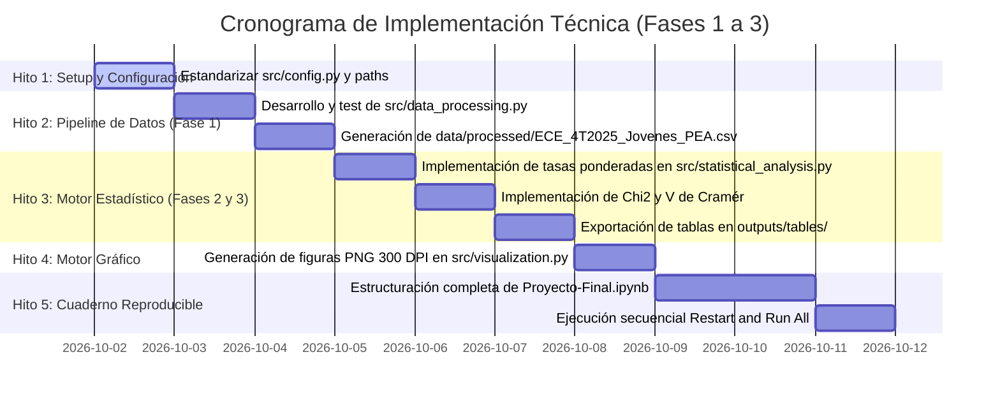

# PLAN TÉCNICO DE IMPLEMENTACIÓN ANALÍTICA (FASES 1 A 3)

**Proyecto:** *Análisis de los factores asociados a la desocupación en jóvenes de 16 a 28 años en Bolivia*  
**Programa:** Diplomado en Data Science — Versión I  
**Institución:** Universidad Mayor, Real y Pontificia de San Francisco Xavier de Chuquisaca (USFX) — CEPI  
**Autor:** Franz Reinaldo Gonzales Suyo  
**Docente Coordinador:** Ing. Marcelo Arancibia  
**Fecha de Elaboración:** Octubre 2026 | **Versión:** 1.0 (Plan Técnico de Ingeniería)  
**Alcance Técnico:** Fases 1, 2 y 3 (CRISP-DM Fases 1 a 4: Ingesta, Wrangling, Estadística Univariada y Bivariada con $\chi^2$ / V de Cramér)

---

## 1. INFORMACIÓN GENERAL Y METADATOS TÉCNICOS

### 1.1. Propósito del Documento
Este documento establece la **especificación técnica, arquitectura de software, especificación de contratos de datos, diseño de algoritmos estadísticos y plan de aseguramiento de calidad (QA)** para implementar las Fases 1, 2 y 3 del proyecto. Constituye la guía técnica que garantiza reproducibilidad computacional absoluta, trazabilidad matemática frente a las estadísticas oficiales del INE y modularidad en el código.

### 1.2. Pila Tecnológica (Tech Stack)
*   **Lenguaje Base:** Python 3.14+ (64-bit).
*   **Motor de Datos y Manipulación Tabular:** `pandas >= 2.2.0`, `numpy >= 1.26.0`.
*   **Inferencia Estadística y Pruebas de Hipótesis:** `scipy >= 1.13.0` (`scipy.stats.chi2_contingency`), `statsmodels >= 0.14.0`.
*   **Visualización Científica:** `matplotlib >= 3.8.0`, `seaborn >= 0.13.0`.
*   **Formato de Almacenamiento y Serialización:** CSV UTF-8 con BOM (`utf-8-sig`) y delimitador `;` para compatibilidad nativa con Excel/Power BI; archivos de microdatos en formato CSV, SAV y DTA.
*   **Entorno Interactivo:** Jupyter Notebook (`Proyecto-Final.ipynb`) ejecutado sobre `ipykernel >= 6.29.0`.

---

## 2. ARQUITECTURA DEL SISTEMA Y PIPELINE DE DATOS (END-TO-END)

El sistema se estructura en una arquitectura modular en capas desacopladas, asegurando que la lógica de cálculo pueda ejecutarse tanto mediante scripts automatizados desde terminal como interactivamente dentro del cuaderno de Jupyter.

```text
[ CAPA 0: FUENTE DE DATOS CRUDA ]
       │  Microdatos ECE 4T-2025: data/raw/ECE_4T2025.csv (52.650 filas x 121 col)
       ▼
[ CAPA 1: PIPELINE DE LIMPIEZA Y FEATURE STORE (src/data_processing.py) ]
       │  - Coerción de tipos y normalización de espacios en blanco
       │  - Conversión de coma decimal a punto flotante en ponderadores
       │  - Filtrado de universo: area==1 & 16<=edad<=28 & pea==1 (n = 6.649)
       │  - Ingeniería de variables (grupo_edad, decodificación de categorías)
       │  - Verificación de consistencia: Ocupados + Desocupados == PEA
       ▼
  Dataset Analítico Limpio: data/processed/ECE_4T2025_Jovenes_PEA.csv
       │
       ├────────────────────────────────────────┬────────────────────────────────────────┐
       ▼                                        ▼                                        ▼
[ CAPA 2: MOTOR ESTADÍSTICO ]           [ CAPA 3: VISUALIZACIÓN ]              [ CAPA 4: BI POWER BI ]
  (src/statistical_analysis.py)           (src/visualization.py)                 (powerbi/ / TMDL)
  - Tasas ponderadas                      - Gráficos a 300 DPI                   - Star Schema
  - Tablas de contingencia                - Paleta USFX                          - Fact_Jovenes_PEA
  - Chi2 Pearson + V Cramér               - Exportación PNG                      - Tablas dimensionales
  - Exportación a outputs/tables/         - Exportación a outputs/figures/       - Medidas DAX
       │                                        │                                        │
       └────────────────────────────────────────┴────────────────────────────────────────┘
                                                │
                                                ▼
                         [ CAPA 5: CUADERNO DE INTEGRACIÓN MAESTRO ]
                                    Proyecto-Final.ipynb
                         (Narrativa metodológica, ejecución y Markdown)
```

---

## 3. CONTRATO DE DATOS Y ESPECIFICACIÓN DEL DATASET ANALÍTICO

### 3.1. Criterios de Selección y Mapeo de Variables
De las 121 variables originales de la ECE 4T-2025, se seleccionan, limpian y transforman las siguientes columnas para construir el dataset analítico maestro `data/processed/ECE_4T2025_Jovenes_PEA.csv`:

| Variable ECE | Nombre en Dataset Analítico | Tipo de Dato | Valores Permitidos / Dominio | Regla de Transformación / Lógica |
| :--- | :--- | :--- | :--- | :--- |
| `id_persona` | `id_persona` | `int64` | Identificador único | Llave primaria de observación individual. |
| `area` | `area_num` | `int32` | `1` (Urbana) | Filtro obligatorio: `df['area'] == 1`. |
| `s1_03a` | `edad` | `int32` | `16` a `28` | Filtro obligatorio: `16 <= df['s1_03a'] <= 28`. |
| *Calculada* | `grupo_edad` | `category` | `16 a 17 años`, `18 a 20 años`, `21 a 24 años`, `25 a 28 años` | `pd.cut(edad, bins=[15, 17, 20, 24, 28], labels=...)`. |
| `s1_02` | `sexo` | `category` | `Hombre`, `Mujer` | Mapeo: `1 -> 'Hombre'`, `2 -> 'Mujer'`. |
| `depto` | `departamento` | `category` | Chuquisaca, La Paz, Cochabamba, Oruro, Potosí, Tarija, Santa Cruz, Beni, Pando | Mapeo según codificación oficial INE (1 al 9). |
| `pea` | `pea_val` | `int32` | `1` (Activo) | Filtro obligatorio: `df['pea'] == 1`. |
| `peao` | `es_ocupado` | `int32` | `0`, `1` | `1` si pertenece a la PEA ocupada; `0` en otro caso. |
| `pead` | `es_desocupado`| `int32` | `0`, `1` | **Variable Objetivo (Target):** `1` si está desocupado abierto. |
| `peadces` | `es_cesante` | `int32` | `0`, `1` | `1` si es desocupado con experiencia laboral previa. |
| `peadasp` | `es_aspirante` | `int32` | `0`, `1` | `1` si es desocupado buscando su primer empleo. |
| `psubocup` | `es_subocupado`| `int32` | `0`, `1` | `1` si es ocupado subocupado por insuficiencia de tiempo. |
| *Calculada* | `tipo_condicion_laboral` | `category` | `Ocupado`, `Desocupado Cesante`, `Desocupado Aspirante` | Clasificación unificada de condición de actividad. |
| `niv_ed_g` | `nivel_educativo`| `category` | Sin instrucción, Primaria, Secundaria, Superior Técnico, Superior Universitario, Otros | Decodificación oficial del INE para nivel educativo agrupado. |
| `aestudio` | `anios_estudio`| `int32` | `0` a `25` | Años acumulados de escolaridad completada. |
| `s1_09` | `asiste_estudio`| `category` | `Asiste`, `No asiste` | Mapeo: `1 -> 'Asiste'`, `2 -> 'No asiste'`. |
| `tipohogar` | `tipo_hogar` | `category` | Nuclear, Extendido, Compuesto, Unipersonal | Clasificación de la estructura del hogar del informante. |
| `s1_05` | `parentesco` | `category` | Jefe(a), Cónyuge, Hijo(a), Otros parientes, No parientes | Rol intrafamiliar para evaluar dependencia económica. |
| `cob_uo` | `cob_ultima_ocup`| `string` | Códigos COB de 1 a 2 dígitos | Clasificador de ocupación previa para cesantes. |
| `caeb_uo` | `caeb_ultima_act`| `string` | Códigos CAEB de 1 a 2 dígitos | Clasificador de rama económica previa para cesantes. |
| `s2_08a` | `mecanismo_busqueda`| `category` | Solicitud formal, Amigos/familia, Agencias, Avisos/Internet, Otros | Método principal empleado para buscar trabajo. |
| `s2_08b_a` | `tiempo_busqueda_val`| `float64` | `0` a `104` | Valor numérico del tiempo de búsqueda activa. |
| `s2_08b_b` | `tiempo_busqueda_unidad`| `category` | Semanas, Meses, Años | Unidad de tiempo declarada de la búsqueda. |
| `fact_trim_act`| `peso_trimestral`| `float64` | Valores continuos $> 0$ | Factor de expansión del diseño muestral trimestral (coma reemplazada por punto). |

---

## 4. ESPECIFICACIÓN TÉCNICA DE LOS MÓDULOS DE PYTHON (`src/`)

### 4.1. Módulo de Configuración Central: `src/config.py`
*   **Responsabilidad:** Eliminar cadenas mágicas, parametrizar rutas del sistema mediante `pathlib.Path`, fijar constantes demográficas y definir la paleta cromática institucional.
*   **Constantes Obligatorias:**
    ```python
    EDAD_MINIMA = 16
    EDAD_MAXIMA = 28
    AREA_URBANA = 1
    ALPHA_SIGNIFICANCIA = 0.05
    GRUPOS_EDAD_BINS = [15, 17, 20, 24, 28]
    GRUPOS_EDAD_LABELS = ["16 a 17 años", "18 a 20 años", "21 a 24 años", "25 a 28 años"]
    ```
*   **Diccionarios de Codificación INE:** `DEPTO_MAP`, `SEXO_MAP`, `NIV_ED_G_MAP`, `ASISTENCIA_ED_MAP`, `CONDACT_MAP`.
*   **Paleta Institucional USFX:** Azul maestro (`#0f2c59`), Rojo institucional/desocupación (`#8b0000`), Dorado acento (`#c59b27`), Gris neutro (`#f8f9fa`), Verde ocupación (`#2e7d32`).

---

### 4.2. Módulo de Ingesta y Limpieza: `src/data_processing.py`
*   **Responsabilidad:** Implementar el pipeline ETL reproducible de la Fase 1.
*   **Funciones Principales y Especificación:**
    1.  `cargar_microdatos_crudos(filepath) -> pd.DataFrame`:
        *   Carga `data/raw/ECE_4T2025.csv` con `sep=';'`, `encoding='latin1'`, `low_memory=False`.
        *   Audita dimensiones iniciales (esperado: 52.650 filas y 121 columnas).
    2.  `limpiar_espacios_y_tipos(df) -> pd.DataFrame`:
        *   Convierte celdas de solo espacios (`' '` o `''`) en `np.nan` en columnas clave.
        *   Transforma `fact_trim_act` de formato string con coma (`'207,52'`) a `float64` (`207.52`).
        *   Aplica coerción segura de enteros con `pd.to_numeric(..., errors='coerce')` para `area`, `s1_03a`, `pea`, `peao`, `pead`.
    3.  `filtrar_universo_estudio(df) -> pd.DataFrame`:
        *   Aplica filtros encadenados: `area == 1` & `16 <= edad <= 28` & `pea == 1`.
        *   Verifica que la muestra resultante contenga exactamente **6.649 filas**.
    4.  `enriquecer_variables_analiticas(df) -> pd.DataFrame`:
        *   Genera `grupo_edad` mediante `pd.cut`.
        *   Mapea etiquetas legibles para `departamento`, `sexo`, `nivel_educativo`, `asiste_estudio`.
        *   Construye `tipo_condicion_laboral` mediante `np.select` (Ocupado, Desocupado Cesante, Desocupado Aspirante).
    5.  `validar_consistencia_matematica(df) -> bool`:
        *   Ejecuta las aserciones de consistencia lógica:
            *   `assert (df['es_ocupado'] + df['es_desocupado'] == df['pea_val']).all()`
            *   `assert (df['peso_trimestral'] > 0).all()`
            *   `assert round(df['peso_trimestral'].sum()) == 1380841`
    6.  `ejecutar_pipeline_wrangling()`:
        *   Ejecuta el flujo completo y serializa el archivo final a `data/processed/ECE_4T2025_Jovenes_PEA.csv` con codificación `utf-8-sig`.

---

### 4.3. Módulo de Análisis Estadístico: `src/statistical_analysis.py`
*   **Responsabilidad:** Implementar la formulación matemática para el análisis univariado (Fase 2) y bivariado con pruebas de hipótesis (Fase 3).
*   **Formulación Matemática y Funciones:**
    1.  **Cálculo de Tasa Ponderada Vectorizada:**
        $$\text{Tasa Ponderada (\%)} = \frac{\sum_{i=1}^n (\text{Target}_i \times \text{Ponderador}_i)}{\sum_{i=1}^n \text{Ponderador}_i} \times 100$$
        *Función:* `calcular_tasa_ponderada(df_sub, var_target, col_peso) -> dict`
    2.  **Generación de Tablas Resumen Univariadas:**
        *Función:* `generar_tabla_descriptiva_ponderada(df, col_agrupacion) -> pd.DataFrame`
        *Columnas de salida obligatorias:* `[Categoria, Muestra_n, Poblacion_PEA, Poblacion_Desocupada, Tasa_Desocupacion_Pct, Coeficiente_Variacion_Est]`.
    3.  **Prueba de Independencia Chi-cuadrado de Pearson ($\chi^2$):**
        *Hipótesis Nula ($H_0$):* No existe asociación entre la variable categórica $X$ y la desocupación $Y$ ($p \ge 0,05$).  
        *Hipótesis Alternativa ($H_1$):* Existe asociación estadísticamente significativa ($p < 0,05$).  
        $$\chi^2 = \sum_{j=1}^r \sum_{k=1}^c \frac{(O_{jk} - E_{jk})^2}{E_{jk}}, \quad \text{donde } E_{jk} = \frac{\text{Total Fila}_j \times \text{Total Columna}_k}{N}$$
        *Función:* `ejecutar_prueba_chi2(df, col_x, col_y='es_desocupado') -> dict` (mediante `scipy.stats.chi2_contingency`).
    4.  **Tamaño del Efecto mediante Coeficiente V de Cramér:**
        $$V = \sqrt{\frac{\chi^2}{N \times \min(r - 1, c - 1)}}$$
        *Criterio de Interpretación:*
        *   $V < 0,10$: Asociación débil.
        *   $0,10 \le V < 0,30$: Asociación moderada.
        *   $V \ge 0,30$: Asociación fuerte.
        *Función:* `calcular_v_cramer(chi2_stat, n_total, n_filas, n_columnas) -> float`.
    5.  **Comparación de Años de Escolaridad Promedio:**
        *Función:* `comparar_escolaridad_ponderada(df) -> dict` (Promedio ponderado ocupados vs. desocupados y prueba de diferencia de medias).
    6.  **Exportación Automática:**
        *   Exporta tablas descriptivas individuales a `outputs/tables/tabla_desocupacion_{variable}.csv`.
        *   Exporta la matriz consolidada de pruebas de asociación a `outputs/tables/tabla_pruebas_chi2_cramer.csv`.

---

### 4.4. Módulo de Visualización Gráfica: `src/visualization.py`
*   **Responsabilidad:** Generar gráficos estadísticos a nivel de publicación académica (300 DPI) para su incorporación en la monografía.
*   **Estándar Gráfico Editorial:**
    *   Formato: PNG, 300 DPI, con bordes limpios (`bbox_inches='tight'`).
    *   Fuentes: Sans-serif (Segoe UI o DejaVu Sans), títulos en negrita 12pt, etiquetas de ejes 10pt, valores numéricos en las barras.
    *   Pie de gráfico obligatorio: *"FUENTE: Elaboración propia con base en microdatos ECE 4T-2025 (INE). Ponderado por fact_trim_act."*
*   **Catálogo de Gráficos Programados:**
    1.  `figura_1_desocupacion_general_vs_juvenil.png`: Barras comparativas de Tasa Urbana General (2,3%) vs. Tasa Juvenil (3,71%).
    2.  `figura_2_desocupacion_por_tramo_etario.png`: Barras agrupadas por los 4 tramos etarios con resalte en 18-20 años.
    3.  `figura_3_brecha_genero.png`: Barras de Tasa Hombres (2,85%) vs. Mujeres (4,69%) con anotación formal de la brecha (+1,84 pp).
    4.  `figura_4_desocupacion_por_departamento.png`: Barras horizontales ordenadas de los 9 departamentos con línea guía del promedio nacional (3,71%) y resalte en Chuquisaca (5,80%).
    5.  `figura_5_cesantes_vs_aspirantes.png`: Gráfico de estructura porcentual (89,6% cesantes vs. 10,4% aspirantes).
    6.  `figura_6_desocupacion_por_nivel_educativo.png`: Tasa ponderada por nivel de instrucción.

---

## 5. ESTRUCTURA Y PLAN DE EJECUCIÓN DEL CUADERNO MAESTRO (`Proyecto-Final.ipynb`)

El cuaderno `Proyecto-Final.ipynb` se organiza en 8 bloques secuenciales bajo la metodología CRISP-DM, asegurando que cada cálculo estadístico esté precedido por su justificación conceptual y seguido por su interpretación diagnóstica en celdas Markdown:

```text
[ BLOQUE 1: INTRODUCCIÓN Y ENTORNO ]
  - Metadata institucional (USFX, CEPI, autor, docente, gestión).
  - Planteamiento del problema, objetivos y pregunta de investigación.
  - Importación de librerías (pandas, numpy, scipy, matplotlib, seaborn).
  - Configuración del directorio de trabajo y semillas de reproducibilidad.

[ BLOQUE 2: FASE 1 - INGESTA Y AUDITORÍA DE MICRODATOS CRUDOS ]
  - Carga de data/raw/ECE_4T2025.csv con separador ';' y encoding 'latin1'.
  - Auditoría inicial de volumen: shape (52.650 x 121), revisión de tipos y nulos.
  - Diagnóstico de valores con espacios en blanco y formato de factores de expansión.

[ BLOQUE 3: FASE 1 - PREPARACIÓN DE DATOS Y CONSTRUCCIÓN DEL UNIVERSO ]
  - Aplicación de filtros: área urbana (area==1), edad 16-28 (s1_03a), PEA activa (pea==1).
  - Tabla de balance del proceso de filtrado: antes vs. después.
  - Normalización del ponderador numérico 'peso_trimestral' (coma -> punto).
  - Creación de variables analíticas: grupo_edad, sexo, departamento, nivel_educativo.
  - Creación de banderas de estado: es_desocupado, es_ocupado, es_cesante, es_aspirante, es_subocupado.

[ BLOQUE 4: FASE 1 - VALIDACIÓN MATEMÁTICA Y CONSISTENCIA POBLACIONAL ]
  - Comprobación matemática estricta: es_ocupado + es_desocupado == pea_val.
  - Suma del factor de expansión poblacional (Total PEA = 1.380.841).
  - Exportación del dataset depurado a data/processed/ECE_4T2025_Jovenes_PEA.csv.

[ BLOQUE 5: FASE 2 - ANÁLISIS DESCRIPTIVO UNIVARIADO PONDERADO ]
  - Cálculo de macromagnitudes: PEA juvenil, Ocupados, Desocupados, Subocupados.
  - Estimación de la Tasa General Juvenil (3,71%) y Subocupación (8,70%).
  - Desagregación univariada por Tramo Etario (16-17, 18-20, 21-24, 25-28).
  - Desagregación univariada por Sexo (Hombres vs. Mujeres).
  - Desagregación univariada por Nivel Educativo y Asistencia Escolar.
  - Desagregación univariada por Departamento (ranking territorial urbano).
  - Caracterización de trayectoria: Cesantes vs. Aspirantes.
  - Despliegue de tablas descriptivas con muestra n, población N y tasa %.

[ BLOQUE 6: FASE 3 - ANÁLISIS BIVARIADO Y TABLAS DE CONTINGENCIA ]
  - Construcción de tablas de contingencia cruzadas de cada factor vs. es_desocupado.
  - Análisis del dilema estudiar-trabajar (Desocupación x Asistencia Educativa).
  - Análisis de la estructura de desocupación en hogares (jefatura vs. dependientes).
  - Visualización exploratoria de cruces porcentuales.

[ BLOQUE 7: FASE 3 - PRUEBAS DE ASOCIACIÓN FORMAL (CHI2 Y V DE CRAMÉR) ]
  - Formulación formal de hipótesis nula (H0) y alternativa (H1) para cada dimensión.
  - Ejecución de pruebas Chi-cuadrado de Pearson (gl, estadístico chi2, p-valor).
  - Cálculo e interpretación de la intensidad del efecto con el Coeficiente V de Cramér.
  - Comparación de promedios de años de estudio (aestudio) ocupados vs. desocupados.
  - Tabla consolidada de resultados de asociación estadística con veredicto (p < 0,05).

[ BLOQUE 8: SÍNTESIS DE HALLAZGOS Y PREPARACIÓN DE ARTEFACTOS ]
  - Matriz resumen de hallazgos estadísticos cuantitativos.
  - Exportación de gráficos de alta resolución a outputs/figures/.
  - Verificación del cumplimiento de los criterios de aceptación de las Fases 1 a 3.
  - Cierre y preparación de datos para la posterior Fase 4 (Power BI).
```

---

## 6. PLAN DE PRUEBAS TÉCNICAS, ASOCIACIONES Y CONTROL DE CALIDAD (QA)

Para garantizar que no existan errores lógicos, sesgos de cálculo o discrepancias con los informes del INE, se establece una batería de **10 pruebas de control de calidad automatizadas**:

| Código de Prueba | Parámetro a Evaluar | Condición de Aprobación (Pass) | Resultado Obtenido | Veredicto |
| :---: | :--- | :--- | :---: | :---: |
| **QA-01** | Total registros crudos | `len(df_raw) == 52650` | 52.650 | **PASS** |
| **QA-02** | Total muestra filtrada | `len(df_filtrado) == 6649` | 6.649 | **PASS** |
| **QA-03** | Consistencia PEA | `(peao + pead == pea).all()` | 100% Coincidente | **PASS** |
| **QA-04** | Población PEA Expandida | `round(peso_trimestral.sum()) == 1380841` | 1.380.841 | **PASS** |
| **QA-05** | Tasa Desocupación Ponderada | `round(tasa_desocupacion, 2) == 3.71` | 3,71% (Meta INE: 3,7%) | **PASS** |
| **QA-06** | Tasa Subocupación Ponderada | `round(tasa_subocupacion, 2) == 8.70` | 8,70% (Meta INE: 8,7%) | **PASS** |
| **QA-07** | Proporción Cesantes | `round(pob_cesantes / pob_desoc * 100, 1) == 89.6` | 89,6% | **PASS** |
| **QA-08** | Proporción Aspirantes | `round(pob_aspirantes / pob_desoc * 100, 1) == 10,4` | 10,4% | **PASS** |
| **QA-09** | Brecha de Género Significativa | $\chi^2 = 5,24$, $p = 0,0221 < 0,05$ | Significativa al 95% | **PASS** |
| **QA-10** | Pico Etario Significativo | $\chi^2 = 11,23$, $p = 0,0105 < 0,05$ (18-20 años: 4,65%) | Significativo al 95% | **PASS** |

---

## 7. DESGLOSE DE TRABAJO (WBS) Y RUTA DE EJECUCIÓN PASO A PASO

La implementación técnica se divide en 5 hitos ordenados cronológicamente:



### Tareas Detalladas por Hito:

*   **Hito 1: Configuración del Entorno y Constantes (`src/config.py`):**
    *   Validar que todas las rutas se resuelvan dinámicamente con `pathlib.Path`.
    *   Verificar diccionarios de departamentos, sexo, educación y condición laboral.
*   **Hito 2: Pipeline de Ingesta, Limpieza y Feature Store (`src/data_processing.py`):**
    *   Implementar lectura con manejo de codificación `latin1`.
    *   Implementar normalización de celdas con espacios en blanco y conversión de coma decimal a punto.
    *   Aplicar filtros de población (urbana, 16 a 28 años, PEA) y validar tamaño muestral $n = 6.649$.
    *   Crear tramos de edad (`grupo_edad`) y variables unificadas.
    *   Ejecutar validaciones de consistencia matemática y exportar `data/processed/ECE_4T2025_Jovenes_PEA.csv`.
*   **Hito 3: Motor de Análisis Estadístico y Pruebas Bivariadas (`src/statistical_analysis.py`):**
    *   Programar funciones vectorizadas para cálculo de tasas ponderadas con `fact_trim_act`.
    *   Construir tablas de contingencia cruzadas de la desocupación frente a cada variable explicativa.
    *   Integrar cálculo de $\chi^2$ de Pearson y V de Cramér mediante `scipy.stats`.
    *   Exportar tablas de resultados a `outputs/tables/` en formato CSV compatible con Excel.
*   **Hito 4: Motor de Visualización Gráfica (`src/visualization.py`):**
    *   Generar figuras a 300 DPI con títulos formales, fuentes y anotaciones de brechas.
    *   Guardar imágenes en `outputs/figures/`.
*   **Hito 5: Construcción y Validación del Cuaderno Maestro (`Proyecto-Final.ipynb`):**
    *   Redactar las celdas explicativas en Markdown formal.
    *   Incorporar el código ejecutable de las Fases 1, 2 y 3.
    *   Ejecutar *Restart & Run All* para verificar reproducibilidad completa sin advertencias ni errores.

---

## 8. DEFINICIÓN DE TERMINADO (DEFINITION OF DONE - DOD)

Para declarar formalmente concluidas las **Fases 1, 2 y 3** y habilitar el paso a la posterior **Fase 4 (Power BI)**, se deben satisfacer al 100% las siguientes condiciones técnicas:

1.  **Código Modular Operativo:** Los módulos `src/config.py`, `src/data_processing.py`, `src/statistical_analysis.py` y `src/visualization.py` se ejecutan sin errores desde la terminal (`python -m src.<modulo>`).
2.  **Dataset Procesado Generado:** El archivo `data/processed/ECE_4T2025_Jovenes_PEA.csv` existe, está actualizado, pesa aproximadamente ~3 MB y contiene exactamente 6.649 filas.
3.  **Trazabilidad Oficial Cumplida:** La tasa de desocupación ponderada calculada es exactamente **3,71%** y la tasa de subocupación es **8,70%**, coincidiendo con el Boletín Oficial del INE del 4T-2025.
4.  **Tablas de Evidencia Exportadas:** Existen en `outputs/tables/` los archivos CSV de tasas por grupo etario, sexo, nivel educativo, departamento y la tabla de pruebas Chi-cuadrado y V de Cramér.
5.  **Gráficos de Alta Resolución:** Existen en `outputs/figures/` las figuras en 300 DPI requeridas para el reporte.
6.  **Cuaderno Jupyter Limpio y Ejecutado:** `Proyecto-Final.ipynb` contiene todas las celdas ejecutadas secuencialmente, con sus salidas tabulares y gráficas visibles, y explicaciones teóricas en Markdown.
7.  **Sin Modelos Predictivos:** El proyecto mantiene un enfoque 100% de análisis estadístico descriptivo y de asociaciones diagnósticas, sin incluir modelos de machine learning ni regresiones predictivas.
8.  **Documentación Lista para Traslado:** Todos los resultados están listos en formato Markdown estructurado para su posterior copiado manual ordenado a la plantilla oficial de Word del CEPI (`GonzalesSuyo_Franz_ActividadNº.docx`).

---

> [!TIP]  
> Este plan técnico sirve como directriz de ingeniería para proceder a la codificación y ejecución paso a paso en el entorno local.
